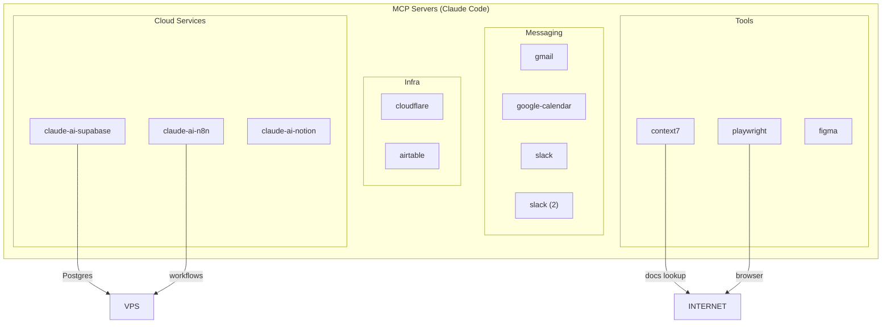
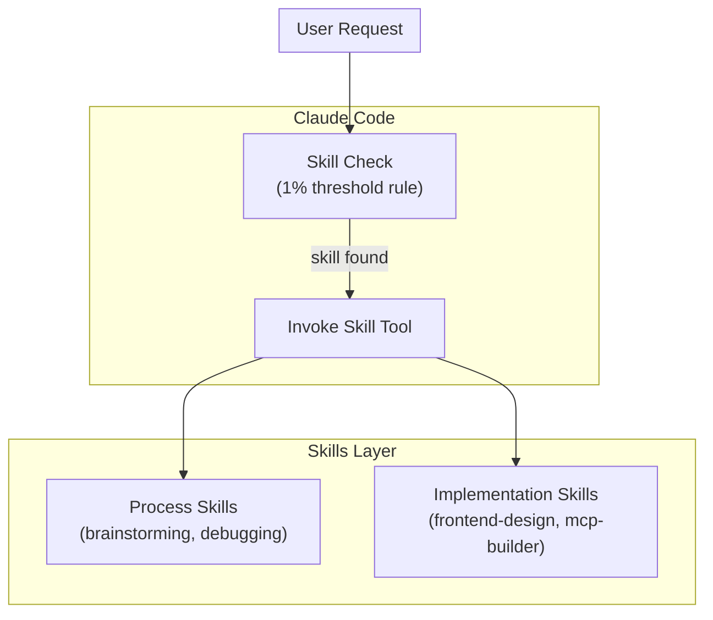
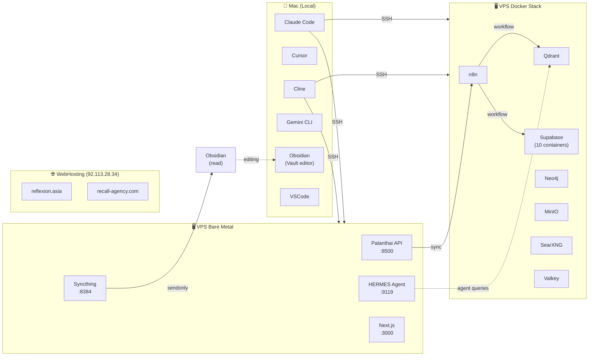

# 🧭 IDE / Skills / MCP / Tools Landscape Map

> Complete map of development tools, MCP servers, skills, and how they connect.
> See also: [[00_COMMAND_CENTER]], [[MCP_SKILLS_SCHEMA]]

---

## 1. Development Tools on Mac

```mermaid
flowchart LR
    subgraph MAC_TOOLS["🍎 Mac Tools"]
        CC["Claude Code<br/>CLI agent (this)"]
        CL["Cline<br/>VSCode extension"]
        CUR["Cursor<br/>AI IDE"]
        GEM["Gemini CLI<br/>Google agent CLI"]
    end

    subgraph VPS["🖥️ VPS (31.97.67.145)"]
        HERMES["HERMES Agent<br/>(Python venv)"]
        N8N["n8n<br/>(Docker)"]
        SYNCTHING["Syncthing<br/>(binary)"]
    end

    CC <-->|"SSH"| VPS
    GEM -.-->|"API"| VPS
    CL -.-->|"SSH"| VPS
    SYNCTHING ==>|"sendonly<br/>palanthai + obsidian-leon"| MAC_TOOLS
```

### Claude Code (this session)
| Attribute | Value |
|---|---|
| **Binary** | `/Users/phil/Documents/AppsData/claude-code/Claude Code.app` |
| **Config** | `~/.claude/` |
| **Model** | MiniMax-M2.7 (current), Opus 4.7 (planning), Sonnet 4.6 (main dev), Haiku 4.5 (light) |
| **Project Context** | SystemMac vault (`/Users/phil/Documents/Vaults/SystemMac/`) |
| **SSH to VPS** | `ssh phil@31.97.67.145` |
| **Skills** | Superpowers (symlinked), custom skills |

### Cline
| Attribute | Value |
|---|---|
| **Type** | VSCode extension (AI coding assistant) |
| **vscode projects** | `/Users/phil/vscode-projects/` |
| **Context** | Different from Claude Code workspace |

### Cursor
| Attribute | Value |
|---|---|
| **Type** | AI-first IDE |
| **vscode projects** | `/Users/phil/Projects/` |
| **Context** | Separate from Cline/Claude Code |

### Gemini CLI
| Attribute | Value |
|---|---|
| **Workspace** | `/Users/phil/Documents/Vaults/SystemMac/gemini-scribe/` |
| **Purpose** | Google AI agent CLI |
| **Note** | Separate from Claude Code |

---

## 2. MCP Servers (Connected to Claude Code)

**Total: 11 MCP servers configured**



### MCP Servers Detail

| Server | Purpose | Status | Connection |
|---|---|---|---|
| `claude-ai-supabase` | Supabase DB, Auth, Storage | ⚠️ Cloud project INACTIVE — local VPS instance used instead | Supabase cloud |
| `claude-ai-n8n` | n8n workflow creation/management | ✅ Active | n8n.recall-agency.com |
| `claude-ai-notion` | Notion pages/databases | ✅ Active | Notion workspace |
| `gmail` | Gmail email | ⚠️ Needs auth | Google |
| `google-calendar` | Google Calendar | ⚠️ Needs auth | Google |
| `slack` (×2) | Slack messaging | ⚠️ Needs auth | Workspace |
| `cloudflare` | Cloudflare API (DNS, CDN, etc.) | ✅ Active | cf.prod |
| `airtable` | Airtable bases | ✅ Active | Workspaces |
| `context7` | Library documentation lookup | ✅ Active | context7.com |
| `playwright` | Browser automation | ✅ Active | Local |
| `figma` | Figma design files | ⚠️ Needs auth | Figma |

### Supabase MCP — Note on Project State
The Supabase MCP attempted to query project `owmucbudvleotyilotoq` (Supabase cloud) but the connection **timed out**. Investigation revealed:
- Project exists but appears INACTIVE
- The **relevant Supabase DB is the local VPS instance** (Docker container `supabase-db`, port 5432)
- When using Supabase MCP, use n8n workflows or direct SSH+psql for local Supabase

---

## 3. Skills System

**Location:** `/Users/phil/Documents/AppsData/superpowers/skills/` (symlinked to `~/.claude/skills/`)

### Available Skills

| Skill | Category | Purpose |
|---|---|---|
| `superpowers:code-review` | Security | Security and quality review of uncommitted changes |
| `superpowers:using-superpowers` | Process | How to access and use skills |
| `tdd-guide` | TDD | Test-driven development enforcement |
| `planner` | Planning | Implementation planning |
| `code-reviewer` | Code review | Post-write code review |
| `security-reviewer` | Security | Security analysis |
| `build-error-resolver` | Troubleshooting | Fix build errors |
| `e2e-runner` | Testing | End-to-end testing |
| `refactor-cleaner` | Maintenance | Dead code cleanup |
| `doc-updater` | Documentation | Update docs |
| `code-architect` | Architecture | System design |
| `feature-dev:code-architect` | Architecture | Feature architecture |
| `feature-dev:code-explorer` | Exploration | Deep codebase analysis |
| `feature-dev:code-reviewer` | Code review | Feature-level review |
| `feature-dev` (orchestrator) | Orchestration | Coordinates feature development agents |
| `gsd-*` (12 agents) | GSD | Get Stuff Done multi-agent system |
| `planner` | Planning | Implementation planning |
| `architect` | Architecture | System design |

**Skill sources:**
- `superpowers:*` from `/Users/phil/Documents/AppsData/superpowers/skills/`
- `feature-dev:*` from Claude Code built-in
- `gsd-*` from Claude Code built-in
- `tdd-guide`, `code-reviewer`, etc. from `~/.claude/agents/`

### Skills Architecture



---

## 4. IDE / Tool Connections

### Mac Tools ↔ VPS

| Mac Tool | Access Method | What it does on VPS |
|---|---|---|
| **Claude Code** | SSH (`ssh phil@31.97.67.145`) | Python scripts, Docker commands, file editing |
| **Gemini CLI** | API calls (no SSH) | Not connected to VPS directly |
| **Cline** | SSH | Same as Claude Code (different session) |
| **Cursor** | SSH | Same as Claude Code |

### n8n Workflows (on VPS Docker)

n8n connects to (via Docker internal network):
- `kong:8000` — Supabase API
- `qdrant:6333` — Vector store
- `redis:6379` — Valkey cache
- `n8n:5678` — Self (internal)

n8n does NOT connect directly to:
- Palanthai API (8500) — use n8n HTTP Request node
- HERMES (9119) — use n8n HTTP Request node
- Neo4j (7687) — use n8n HTTP Request node

---

## 5. Syncthing — What Gets Synced

**Configuration:** `~/.config/syncthing/config.xml` on VPS

| VPS Folder | Mac Destination | Type | Interval |
|---|---|---|---|
| `/home/phil/palanthai` | TBC (on Mac) | sendonly | 3600s |
| `/home/phil/obsidian-leon` | TBC (on Mac) | sendonly | 3600s |

**Mode:** `sendonly` — VPS → Mac only, Mac cannot push changes back.

This means:
- **On Mac:** Read-only access to VPS files
- **Edit on Mac:** Changes do NOT sync to VPS
- **Edit on VPS:** Changes sync to Mac after 3600s rescan

---

## 6. Claude Code Session Context

When Claude Code starts a session on SystemMac:
1. Reads `CLAUDE.md` (project root)
2. Reads `SystemMac/CLAUDE.md` (this vault)
3. Reads `~/.claude/rules/common/*.md` (coding style, git workflow, security, etc.)
4. Accesses skills from `~/.claude/skills/` (symlinked from `/Users/phil/Documents/AppsData/superpowers/skills/`)
5. Uses MCP servers for external services

### Current Session
- **Project:** SystemMac vault (`/Users/phil/Documents/Vaults/SystemMac/`)
- **Model:** MiniMax-M2.7
- **Working on:** VPS architecture audit + documentation update
- **Skills invoked:** `superpowers:using-superpowers`, `code-review`

---

## 7. What Runs Where



---

## 8. Karpathy Wiki Pattern — Knowledge Graph

SystemMac follows the Karpathy 3-layer wiki pattern:

```
WIKI/raw/          → Immutable sources (raw notes, copied content)
WIKI/wiki/          → LLM-generated summaries and connections
WIKI_SCHEMA.md     → Schema definition
```

This is the **personal knowledge graph** that User declined to extend with cloud DB (Chroma/Pinecone/Firebase). See [[WIKI_SCHEMA]] for details.

---

*Dernière mise à jour : 2026-05-01*
*See also: [[00_COMMAND_CENTER]], [[VPS_SERVICE_MAP]], [[VPS_ARCHITECTURE_DIAGRAM]], [[MCP_SKILLS_SCHEMA]]*