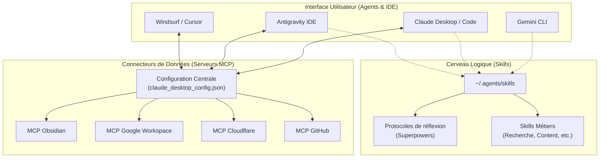

# 🏗️ Architecture des Agents, Skills et MCP

Cette note définit l'organisation cible pour garantir la cohérence des capacités IA entre vos différents outils (**Claude Desktop/Code**, **Antigravity**, **Gemini CLI**, **Windsurf**).

## 📊 Schéma Conceptuel

## 🛠️ Principes d'Organisation

### 1. La Configuration Centrale (MCP)
**Priorité : Claude Desktop Config** (`~/Library/Application Support/Claude/claude_desktop_config.json`)
*   **Pourquoi ?** C'est le standard de fait. Claude Code et Antigravity savent lire ce fichier.
*   **Règle :** Tout serveur de données (Obsidian, Google, GitHub) doit être configuré ici une seule fois. Cela évite les processus multiples et les conflits de ports.

### 2. Le Répertoire de Skills (Logique)
**Emplacement :** `~/.agents/skills`
*   **Contenu :** Fichiers Markdown définissant des protocoles (TDD, Debugging, Article Writing).
*   **Distribution :** Les agents (comme Gemini CLI) pointent vers ce dossier pour "apprendre" comment vous voulez qu'ils travaillent.

### 3. Les Extensions Spécifiques (Agents)
**Emplacement :** `~/.gemini/extensions`
*   **Usage :** Uniquement pour les outils qui ajoutent des commandes CLI natives ou des fonctionnalités de bas niveau à Gemini.

## 🚀 État de la Solidification (Avril 2026)

1.  **Nettoyage effectué :** Suppression des dossiers résiduels (`server`, `temp_mcp`, `~`) qui polluaient le Home.
2.  **Dépannage :** Suppression de l'extension `mcp-neo4j` corrompue.
3.  **Prochaine étape :** Migrer les commandes `npx` des outils Google et Obsidian directement dans le JSON central de Claude.

---
*Dernière mise à jour : 2026-04-10*
