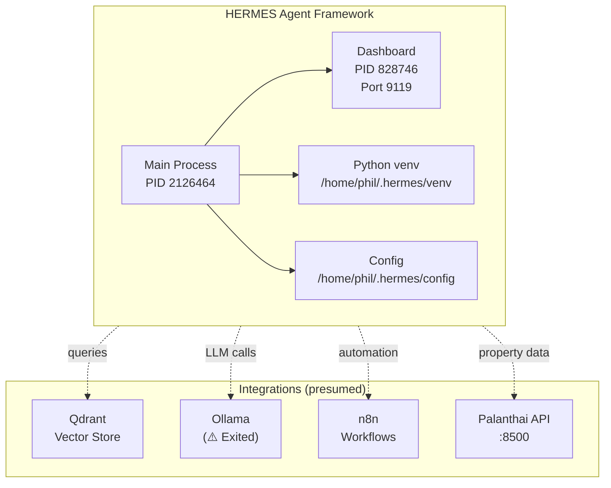

# 🔮 HERMES Agent Mapping

> HERMES: Python-based agent framework installed on VPS (non-Docker).
> Replaces OpenClaw (npm packages still present but unused).
> See also: [[VPS_SERVICE_MAP]], [[VPS_ARCHITECTURE_DIAGRAM]]

---

## Overview

**HERMES** is a Python-based agent/gateway installed at `/home/phil/.hermes/` on the VPS.
It runs as a Python venv application (not Docker) and provides an agentic layer.

| Attribute | Value |
|---|---|
| **Install Location** | `/home/phil/.hermes/` |
| **Type** | Python venv (not Docker) |
| **Main Process PID** | 2126464 |
| **Dashboard PID** | 828746 |
| **Dashboard Port** | 9119 |
| **Dashboard Binding** | `100.78.110.61:9119` (internal IP) |
| **Replaces** | OpenClaw (npm packages still installed) |
| **Status** | ✅ Running |

---

## Architecture



---

## OpenClaw — Cleanup Candidate

**OpenClaw was the previous agent solution.** It was installed as npm packages but is no longer used. HERMES has replaced it.

### OpenClaw npm packages still present:
```
clawdock@0.3.2
clawhub@0.7.0
```

**Location:** `/home/phil/local-ai-packaged/node_modules/`

### Decision needed:
- **Option A (recommended):** Remove OpenClaw npm packages to clean up
- **Option B:** Keep as fallback if HERMES fails

---

## Dashboard Access

**URL:** `http://100.78.110.61:9119`
**Binding:** Internal IP only — NOT accessible from internet (not proxied by Caddy)

To access from Mac:
```bash
# Via SSH tunnel (if VPN/local network)
ssh -L 9119:100.78.110.61:9119 phil@31.97.67.145
# Then open http://localhost:9119
```

Or via Tailscale VPN:
```bash
# Connect to Tailscale first, then access
curl http://100.78.110.61:9119
```

---

## Configuration Files

**Location:** `/home/phil/.hermes/`

Expected structure (untested):
```
.hermes/
├── config/              # Configuration files
├── venv/                # Python virtual environment
├── logs/                # Application logs
├── data/                # Runtime data
└── hermes.conf         # Main config
```

---

## Process Management

```bash
# Check HERMES process
ssh phil@31.97.67.145 'ps aux | grep hermes'

# Check dashboard port
ssh phil@31.97.67.145 'ss -tlnp | grep 9119'

# Restart HERMES (if service file exists)
ssh phil@31.97.67.145 'systemctl restart hermes 2>/dev/null || echo "No systemd service"'

# Check logs
ssh phil@31.97.67.145 'tail -f /home/phil/.hermes/logs/*.log 2>/dev/null || echo "No logs found"'
```

---

## Integration Points

HERMES likely connects to:
- **Qdrant** — for vector search / RAG
- **Ollama** — for LLM inference (⚠️ currently stopped)
- **n8n** — for workflow automation
- **Palanthai API** — for property data

Exact integration architecture needs further investigation.

---

## Files to Audit

For security review (not yet done):
```
/home/phil/.hermes/config/*     # All config files
/home/phil/.hermes/*.py         # Python source
/home/phil/.hermes/*.json       # Any JSON config
/home/phil/.hermes/.env          # Environment variables
```

---

## Open Questions

1. **Startup method:** How does HERMES start on boot? systemd service or manual?
2. **Credentials:** Are there hardcoded credentials in HERMES config?
3. **Integration scope:** Which services does HERMES actually connect to?
4. **Alternative:** Should HERMES connect to n8n or replace n8n workflows?

---

*Dernière mise à jour : 2026-05-01*
*See also: [[VPS_SERVICE_MAP]], [[VPS_ARCHITECTURE_DIAGRAM]], [[VPS_BACKUP_INFRASTRUCTURE]]*