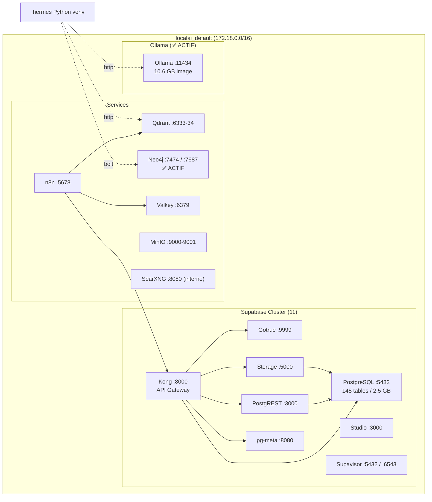
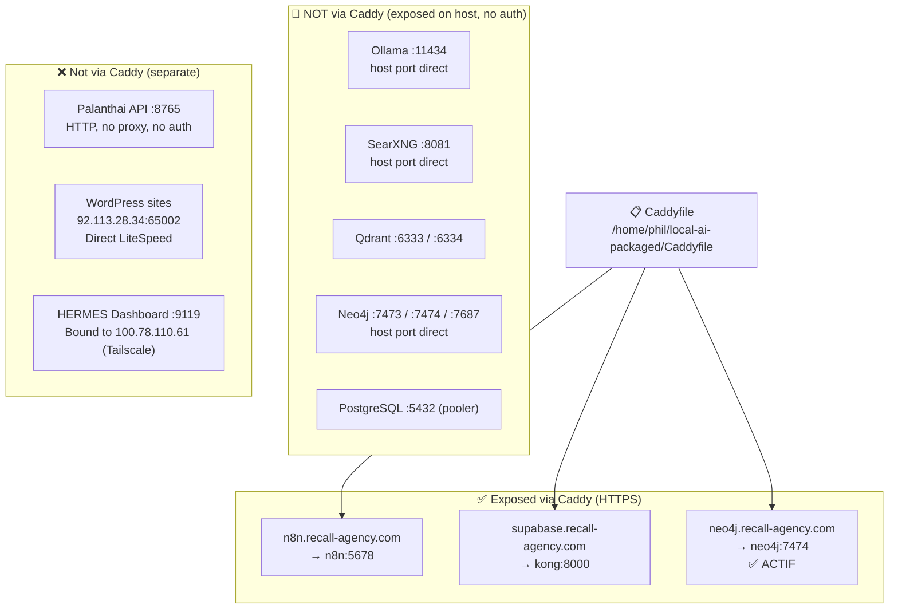
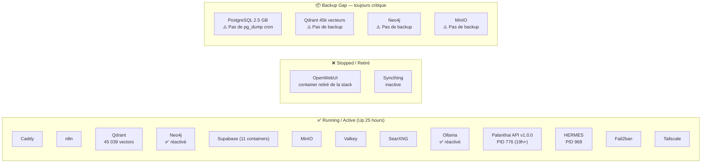
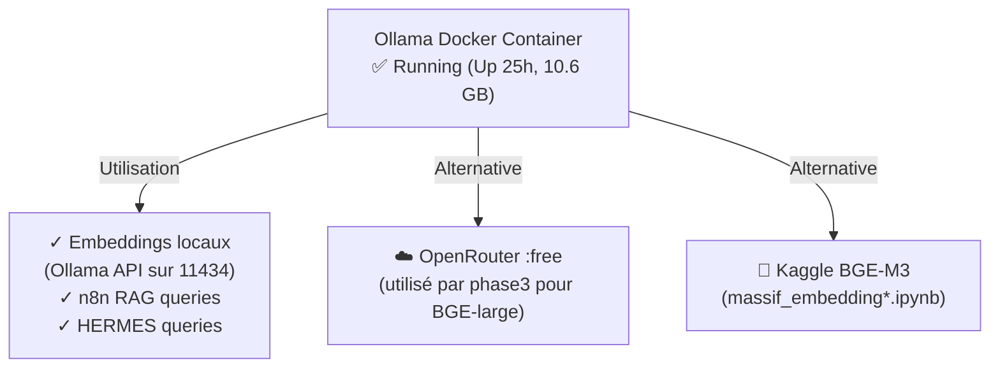
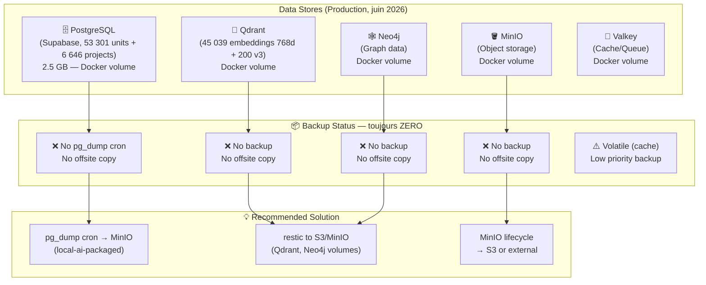

# 🔬 VPS Architecture Diagram

> Diagramme Mermaid de l'architecture complète du VPS Hostinger (au 2026-06-01).
> Voir aussi : [[VPS_INFRASTRUCTURE_REFERENCE]], [[VPS_SERVICE_MAP]], [[VPS_ACCESS_REFERENCE]]

---

## Vue d'ensemble — Infrastructure Complete

```mermaid
flowchart TB
    subgraph INTERNET["🌐 Internet"]
        USER([👤 User / Agent])
    end

    subgraph VPS["🖥️ VPS Hostinger (31.97.67.145) — Ubuntu 24.04.4 LTS"]
        subgraph DOCKER["🐳 Docker Stack (/home/phil/local-ai-packaged/) — 19 containers"]
            CADDY["🟡 Caddy<br/>:80, :443, :2019<br/>Reverse Proxy + TLS"]
            N8N["⚡ n8n<br/>n8nio/n8n:latest<br/>:5678 → https://n8n.recall-agency.com"]
            SUPABASE["📦 Supabase Stack (11 containers)"]
            SUPABASE_KONG["🔷 Kong API Gateway<br/>kong:2.8.1<br/>:8000, :8443"]
            SUPABASE_DB["🗄️ PostgreSQL<br/>15.8.1.085 — 145 tables / 2.5 GB<br/>:5432 (interne)"]
            SUPABASE_AUTH["🔐 Gotrue Auth<br/>gotrue:v2.184.0"]
            SUPABASE_REST["📋 PostgREST<br/>postgrest:v14.1<br/>:3000"]
            SUPABASE_STUDIO["🎨 Supabase Studio<br/>2025.12.17<br/>:3000"]
            SUPABASE_STORAGE["📁 Storage API<br/>v1.33.0 :5000"]
            SUPABASE_META["🧩 pg-meta<br/>v0.95.1 :8080"]
            QDRANT["🔢 Qdrant<br/>qdrant/qdrant:latest<br/>:6333, :6334<br/>units 45 039 (768d) + units_v3 200 (1024d)"]
            NEO4J["🕸️ Neo4j<br/>neo4j:latest<br/>:7473, :7474, :7687<br/>✅ ACTIF"]
            MINIO["🪣 MinIO<br/>minio/minio:latest<br/>:9000, :9001 (interne)"]
            VALKEY["🔴 Valkey/Redis<br/>valkey/valkey:8-alpine<br/>:6379"]
            SEARXNG["🔍 SearXNG<br/>searxng/searxng:latest<br/>:8081→:8080 (interne)"]
            OLLAMA["🤖 Ollama<br/>ollama/ollama:latest<br/>:11434<br/>✅ ACTIF (10.6 GB image)"]

            CADDY --> N8N
            CADDY --> SUPABASE_KONG
            CADDY --> NEO4J
            SUPABASE_KONG --> SUPABASE_AUTH
            SUPABASE_KONG --> SUPABASE_REST
            SUPABASE_KONG --> SUPABASE_STORAGE
            SUPABASE_KONG --> SUPABASE_DB
            SUPABASE_KONG --> SUPABASE_META
        end

        subgraph BARE_METAL["⚙️ Bare Metal / host network"]
            PALANTHAI_API["🤖 Palanthai API v1.0.0<br/>nohup uvicorn :8765 (--reload)<br/>49 routes — systemD disabled<br/>PID 776"]
            NEXTJS["📱 Next.js (temp-app)<br/>:3000 / :5173"]
            HERMES["🔮 HERMES Agent<br/>Python venv<br/>Dashboard :9119 (Tailscale 100.78.110.61)"]
            SYNCTHING["🔄 Syncthing<br/>:8384<br/>❌ INACTIVE"]
            FAIL2BAN["🛡️ Fail2ban<br/>✅ active"]
            TAILSCALE["🌊 Tailscale<br/>✅ active (100.78.110.61)"]
        end
    end

    subgraph WEBHOSTING["🌐 Shared Hosting (92.113.28.34) — LiteSpeed + PHP"]
        WP_REFLEXION["🌴 reflexion.asia<br/>Houzez theme<br/>RankMath SEO<br/>✅ Production"]
        WP_RECALL["🏠 recall-agency.com<br/>Astra child theme<br/>RankMath + Polylang<br/>✅ Production FR/EN"]
        WP_PATRIMONASIA["💎 patrimonasia.com<br/>❌ Not built yet<br/>En attente reflexion+recall stable"]
    end

    subgraph MAC["🍎 Mac (Local)"]
        SYNC_PALANTHAI["📁 /home/phil/palanthai<br/>sendonly ← VPS"]
        SYNC_OBSIDIAN["📁 /home/phil/obsidian-leon<br/>sendonly ← VPS"]
    end

    USER -->|HTTPS| CADDY
    USER -->|"HTTP :8765 (no proxy)"| PALANTHAI_API
    USER -->|"HTTPS :3000"| NEXTJS
    USER -->|HTTPS direct| WP_REFLEXION
    USER -->|HTTPS direct| WP_RECALL
    USER -->|HTTPS direct| WP_PATRIMONASIA
    USER -->|"Tailscale"| HERMES

    SYNCTING -.->|"sendonly (config)"| SYNC_PALANTHAI
    SYNCTING -.->|"sendonly (config)"| SYNC_OBSIDIAN
```

---

## Data Pipeline Flow — Scraping to WordPress

```mermaid
flowchart LR
    subgraph SCRAPING["Phase 1 — Scraping (/home/phil/palanthai/phase1_extraction)"]
        LP["LivePhuket.com"]
        SC["source_crawler.py<br/>(6 regions)"]
        WF["wf_extract/*.py<br/>(12 city/type combos)"]
        FULLRUN["fullrun/fullrun.py<br/>(JSONL batches)"]
        LD["RUN_LOCKDOWN/<br/>(lockdown workflow)"]
    end

    subgraph INGESTION["Phase 2 — Sync (/home/phil/palanthai/phase2_sync)"]
        WF_PROTO["wf_proto.py<br/>(24K — orchestrateur)"]
        EXTRACT["extract_one.py"]
        DB["db_io.py<br/>(Supabase upsert)"]
    end

    subgraph EXTRACTION_EMBEDDING["Phase 3 — Content & Embedding (phase3_embedding_graph)"]
        CLEAN["data_cleaner.py<br/>(brand → Reflexion)"]
        OLLAMA_EMB["embed_to_qdrant.py<br/>(Ollama → Qdrant)"]
        KAGGLE["kaggle_bge_m3.ipynb<br/>(BGE-large via Kaggle)"]
        QDRANT_COL["🔢 Qdrant units<br/>45 039 pts (768d) + units_v3 200 (1024d)"]
    end

    subgraph RAG_SERVICE["RAG / API"]
        PALANTHAI_API["🤖 Palanthai API v1.0.0<br/>nohup uvicorn :8765<br/>49 routes (/scraper /wf_proto /sync /seo /content /units /memory ...)"]
        HERMES["HERMES Agent<br/>(.hermes Python venv)"]
    end

    subgraph AUTOMATION["n8n Workflows"]
        N8N_WF["n8n :5678<br/>Local_RAG_AI_Agent.json<br/>(1 workflow actif)"]
    end

    subgraph PUBLISHING["Publishing"]
        WP_R["🌴 reflexion.asia"]
        WP_REC["🏠 recall-agency.com"]
    end

    LP --> SC --> WF --> FULLRUN
    FULLRUN --> WF_PROTO --> EXTRACT --> DB
    DB --> CLEAN --> OLLAMA_EMB --> QDRANT_COL
    KAGGLE -.->|alternative| QDRANT_COL
    QDRANT_COL --> PALANTHAI_API --> HERMES
    PALANTHAI_API -->|"RAG queries"| N8N_WF
    N8N_WF -->|"SEO automation"| WP_R
    N8N_WF -->|"content generation"| WP_REC
```

---

## Docker Network — Internal Connections

---

## Caddy Proxy Routing

---

## Service Health Status (au 2026-06-01)

---

## Décision Ollama → Résolu (✅)

---

## Backup Gap Analysis (inchangé depuis 2026-05-01)

---

*Dernière mise à jour : 2026-06-01 | Refresh sur base inspection live VPS*
*Voir : [[VPS_SERVICE_MAP]], [[VPS_BACKUP_INFRASTRUCTURE]], [[VPS_INFRASTRUCTURE_REFERENCE]], [[VPS_ACCESS_REFERENCE]], [[Network_Architecture]]*
