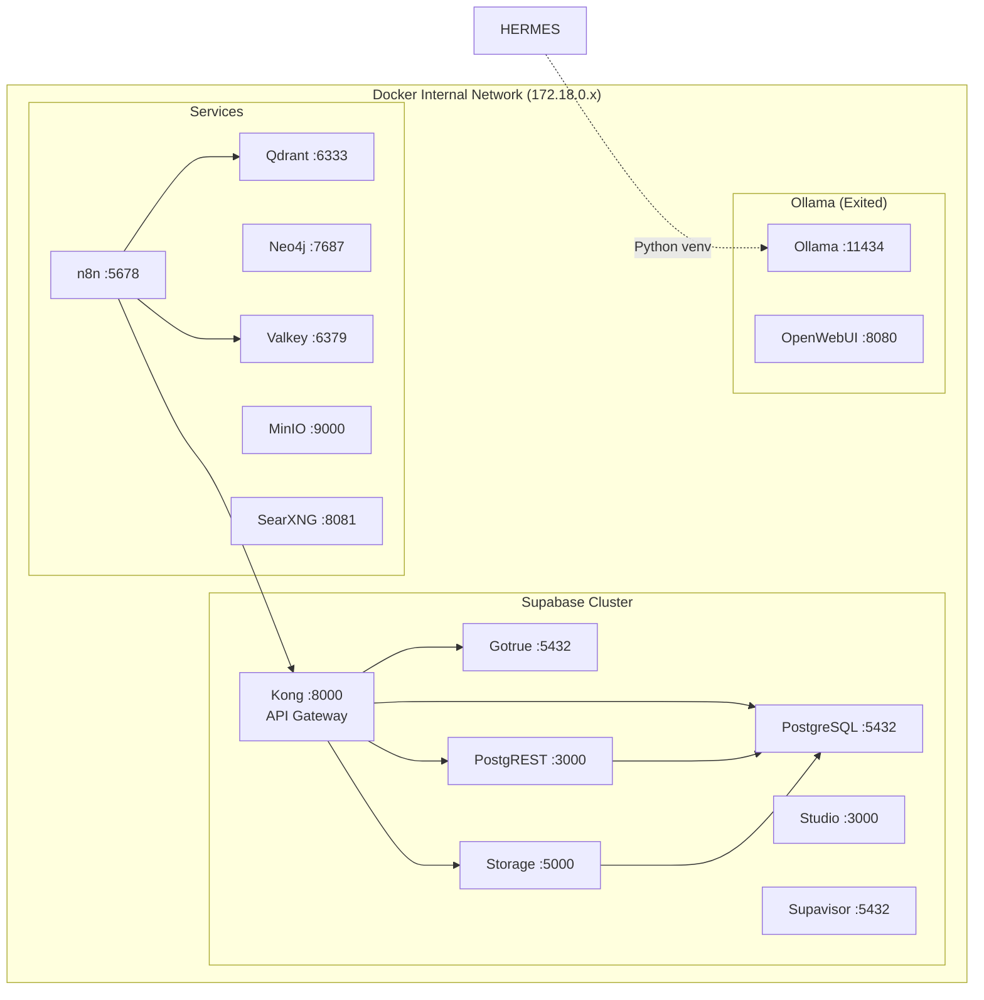
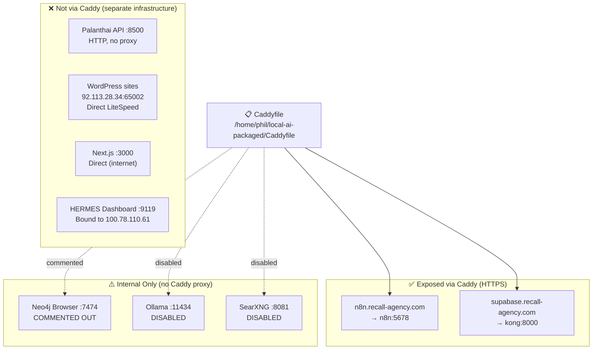
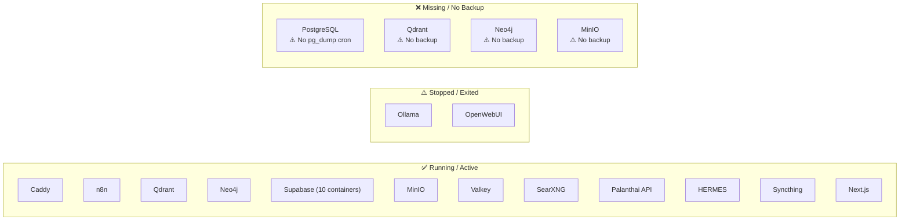
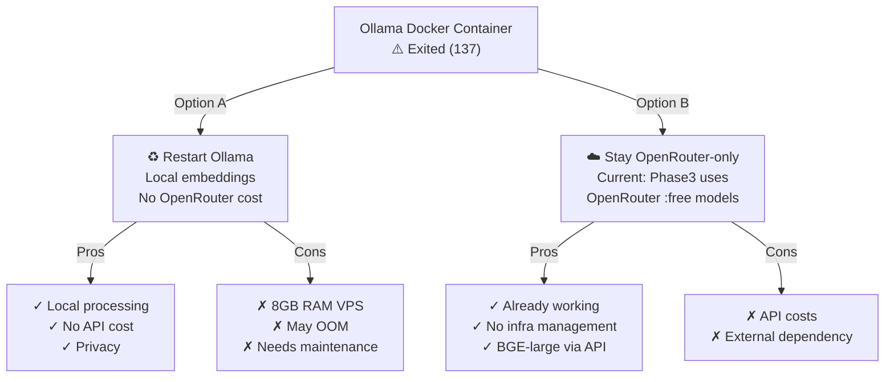
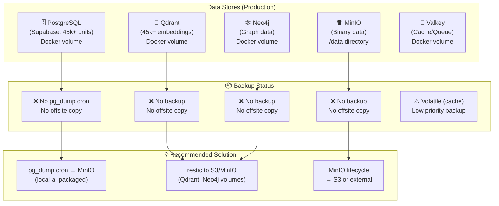

# 🔬 VPS Architecture Diagram

> Diagramme Mermaid de l'architecture complète du VPS Hostinger.
> Voir aussi : [[VPS_INFRASTRUCTURE_REFERENCE]], [[VPS_SERVICE_MAP]]

---

## Vue d'ensemble — Infrastructure Complete

```mermaid
flowchart TB
    subgraph INTERNET["🌐 Internet"]
        USER([👤 User / Agent])
    end

    subgraph VPS["🖥️ VPS Hostinger (31.97.67.145) — Ubuntu 24.04 LTS"]
        subgraph DOCKER["🐳 Docker Stack (/home/phil/local-ai-packaged/)"]
            CADDY["🟡 Caddy<br/>:80, :443<br/>Reverse Proxy + TLS"]
            N8N["⚡ n8n<br/>:5678 → https://n8n.recall-agency.com"]
            SUPABASE["📦 Supabase Stack (10 containers)"]
            SUPABASE_KONG["🔷 Kong API Gateway<br/>:8000, :8443"]
            SUPABASE_DB["🗄️ PostgreSQL<br/>:5432"]
            SUPABASE_AUTH["🔐 Gotrue Auth<br/>:5432"]
            SUPABASE_REST["📋 PostgREST<br/>:3000"]
            SUPABASE_STUDIO["🎨 Supabase Studio<br/>:3000"]
            SUPABASE_STORAGE["📁 Storage API<br/>:5000"]
            QDRANT["🔢 Qdrant<br/>:6333, :6334<br/>45k+ units, 768 dims"]
            NEO4J["🕸️ Neo4j<br/>:7474, :7687<br/>Graph DB"]
            MINIO["🪣 MinIO<br/>:9000, :9001<br/>Object Storage"]
            VALKEY["🔴 Valkey/Redis<br/>:6379<br/>Cache/Queue"]
            SEARXNG["🔍 SearXNG<br/>:8081<br/>Meta-Search"]
            OLLAMA["🤖 Ollama<br/>:11434<br/>⚠️ Exited"]
            OPENWEBUI["🌐 OpenWebUI<br/>⚠️ Exited"]

            CADDY --> N8N
            CADDY --> SUPABASE_KONG
            SUPABASE_KONG --> SUPABASE_AUTH
            SUPABASE_KONG --> SUPABASE_REST
            SUPABASE_KONG --> SUPABASE_STORAGE
            SUPABASE_KONG --> SUPABASE_DB
        end

        subgraph BARE_METAL["⚙️ Bare Metal / Systemd"]
            PALANTHAI_API["🤖 Palanthai API<br/>:8500 (HTTP)<br/>systemd/uvicorn"]
            NEXTJS["📱 Next.js (temp-app)<br/>:3000 (public)<br/>:5173 (localhost)"]
            HERMES["🔮 HERMES Agent<br/>Python venv<br/>Dashboard :9119"]
            SYNCTHING["🔄 Syncthing<br/>:8384<br/>sendonly → Mac"]
            MINIO_BIN["🪣 MinIO (binary)<br/>:9000, :9001"]
            FAIL2BAN["🛡️ Fail2ban<br/>SSH brute-force protection"]
            TAILSCALE["🌊 Tailscale<br/>VPN access"]
        end
    end

    subgraph WEBHOSTING["🌐 Shared Hosting (92.113.28.34) — LiteSpeed + PHP"]
        WP_REFLEXION["🌴 reflexion.asia<br/>Houzez theme<br/>RankMath SEO<br/>✅ Production"]
        WP_RECALL["🏠 recall-agency.com<br/>Astra child theme<br/>RankMath + Polylang<br/>✅ Production FR/EN"]
        WP_PATRIMONASIA["💎 patrimonasia.com<br/>❌ Not built yet<br/>En attente reflexion+recall stable"]
    end

    subgraph MAC["🍎 Mac (Local)"]
        SYNC_PALANTHAI["📁 /home/phil/palanthai<br/>sendonly ← VPS"]
        SYNC_OBSIDIAN["📁 /home/phil/obsidian-leon<br/>sendonly ← VPS"]
    end

    USER -->|HTTPS| CADDY
    USER -->|"HTTPS :8500 (no proxy)"| PALANTHAI_API
    USER -->|"HTTPS :3000"| NEXTJS
    USER -->|HTTPS (direct)| WP_REFLEXION
    USER -->|HTTPS (direct)| WP_RECALL
    USER -->|HTTPS (direct)| WP_PATRIMONASIA

    SYNCTHING ==>|"3600s rescan"| SYNC_PALANTHAI
    SYNCTHING ==>|"3600s rescan"| SYNC_OBSIDIAN
```

---

## Data Pipeline Flow — Scraping to WordPress

```mermaid
flowchart LR
    subgraph SCRAPING["Phase 1 — Scraping"]
        LP["LivePhuket.com"]
        SC["source_crawler.py<br/>(6 regions)"]
        WF["wf_extract/*.py<br/>(12 city/type combos)"]
        FULLRUN["fullrun/fullrun.py<br/>(JSONL batches)"]
    end

    subgraph INGESTION["Phase 2 — Ingestion"]
        INGEST["ingestor_v5.py<br/>(multi-DB)"]
        SEQUENCER["phase2/sequencer_v2.py"]
        DB["db_ingestor_units.py<br/>(Supabase upsert)"]
    end

    subgraph EXTRACTION_EMBEDDING["Phase 3 — Content & Embedding"]
        CLEAN["data_cleaner.py<br/>(brand → Reflexion)"]
        OLLAMA_EMB["embed_to_qdrant.py<br/>(Ollama → Qdrant)"]
        QDRANT_COL["🔢 Qdrant units<br/>(768 dims, ≥75 quality)"]
    end

    subgraph RAG_SERVICE["Phase 3+ — RAG"]
        PALANTHAI_API["Palanthai API<br/>:8500"]
        HERMES["HERMES Agent"]
    end

    subgraph AUTOMATION["n8n Workflows"]
        N8N_WF["n8n workflows<br/>(SEO, content, sync)"]
    end

    subgraph PUBLISHING["Phase 3+ — Publishing"]
        WP_R["🌴 reflexion.asia"]
        WP_REC["🏠 recall-agency.com"]
    end

    LP --> SC --> WF --> FULLRUN
    FULLRUN --> INGEST --> SEQUENCER --> DB
    DB --> CLEAN --> OLLAMA_EMB --> QDRANT_COL
    QDRANT_COL --> PALANTHAI_API --> HERMES
    PALANTHAI_API -->|"RAG queries"| N8N_WF
    N8N_WF -->|"SEO automation"| WP_R
    N8N_WF -->|"content generation"| WP_REC
```



---

## Docker Network — Internal Connections



---

## Caddy Proxy Routing



---

## Service Health Status



---

## Ollama Decision Map



---

## Backup Gap Analysis



---

*Dernière mise à jour : 2026-05-01*
*Voir : [[VPS_SERVICE_MAP]], [[VPS_BACKUP_INFRASTRUCTURE]], [[VPS_INFRASTRUCTURE_REFERENCE]]*