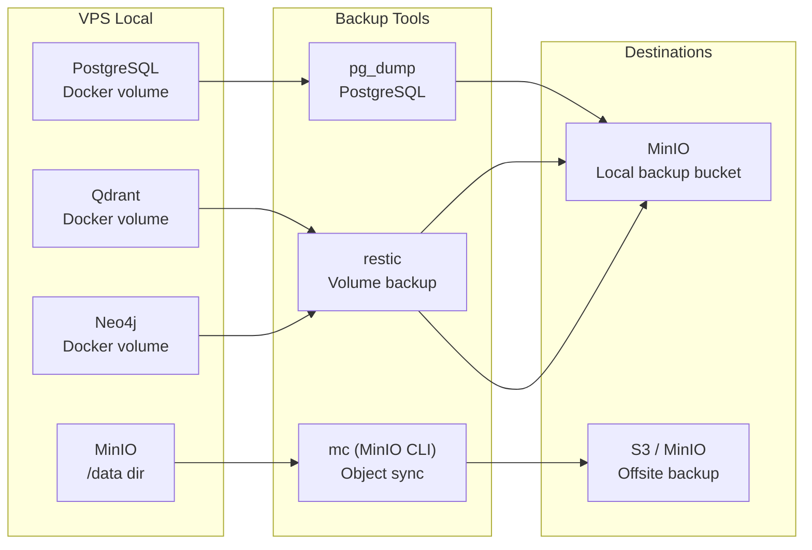

# 💾 VPS Backup Infrastructure — Gap Analysis

> **⚠️ CRITICAL: No backup infrastructure exists.** If disk fails, all data is lost.
> See also : [[VPS_INFRASTRUCTURE_REFERENCE]], [[VPS_SERVICE_MAP]]

---

## 🚨 Executive Summary

**Current State:** ZERO automated backups across all data stores.
**Risk Level:** CRITICAL — single point of failure for production data.
**Immediate Action Required:** Implement backup solution before any new data ingestion.

### Data at Risk
| Data Store | Size | Records | Last Backup |
|---|---|---|---|
| PostgreSQL (Supabase) | Unknown | 45k+ units + metadata | ❌ Never |
| Qdrant | Unknown | 45,039 embeddings (768 dims) | ❌ Never |
| Neo4j | Unknown | Graph data | ❌ Never |
| MinIO | Unknown | Binary files | ❌ Never |
| Valkey | ~MB | Cache/Queue | ⚠️ Low priority |

---

## 1. Current Data Volumes

### PostgreSQL (Supabase)
**Container:** `supabase-db`
**Volume:** `supabase-db-data`
**Mount point (container):** `/var/lib/postgresql/data`
**Volume location (host):**
```bash
docker volume inspect --format '{{.Mountpoint}}' supabase-db-data
# Expected: /home/phil/local-ai-packaged/supabase/docker/volumes/db/
```

**Content:**
- `fullrun_projects_live` — projects data
- `fullrun_project_images` — project images
- `fullrun_project_floor_plans` — floor plans
- `fullrun_unit` — unit records
- `fullrun_unit_images` — unit images
- `fullrun_unit_floor_plans` — unit floor plans
- Plus Palanthai operational tables

**Backup method needed:** `pg_dump` via cron job

### Qdrant
**Container:** `qdrant`
**Volume:** `local-ai_qdrant-data`
**Mount point (container):** `/qdrant/storage`
**Collection:** `units` — 45,039 points, 768 dimensions

**Backup method needed:** Qdrant has no native backup command. Options:
- Volume snapshot (Docker volume backup)
- `restic` backup of volume directory
- S3 lifecycle with versioning

### Neo4j
**Container:** `neo4j`
**Volume:** `neo4j-data`
**Mount point (container):** `/data`
**Content:** Graph nodes/relationships for property intelligence

**Backup method needed:** `neo4j-admin dump` or volume snapshot

### MinIO
**Container:** `minio`
**Volume:** `minio-data`
**Mount point (container):** `/data`
**Content:** Object storage (binary files)

**Backup method needed:** `mc mirror` to external S3 or MinIO lifecycle policies

---

## 2. Backup Solution Architecture

### Recommended Stack



### Option A: All Backups to Local MinIO (Quick Setup)
```
pg_dump → restic → MinIO bucket "backups"
restic backup /var/lib/docker/volumes/local-ai_qdrant-data → MinIO
restic backup /var/lib/docker/volumes/neo4j-data → MinIO
```

### Option B: MinIO → S3 Offsite (Recommended for Production)
```
MinIO bucket "backups" → S3 lifecycle policy
restic → MinIO → S3 (or directly to S3)
```

---

## 3. Implementation Plan

### Phase 1: Critical Backup (This Week)

#### 3.1 PostgreSQL — pg_dump Cron

```bash
# Create backup script
cat > /home/phil/local-ai-packaged/scripts/pg_backup.sh << 'EOF'
#!/bin/bash
DATE=$(date +%Y%m%d_%H%M%S)
BACKUP_DIR="/home/phil/local-ai-packaged/backups/pg"
mkdir -p "$BACKUP_DIR"

# pg_dump from container
docker exec supabase-db pg_dump -U postgres -d postgres > "$BACKUP_DIR/pg_backup_$DATE.sql"

# Keep last 7 days, delete older
find "$BACKUP_DIR" -name "pg_backup_*.sql" -mtime +7 -delete
EOF

chmod +x /home/phil/local-ai-packaged/scripts/pg_backup.sh

# Add to crontab
(crontab -l 2>/dev/null; echo "0 3 * * * /home/phil/local-ai-packaged/scripts/pg_backup.sh >> /home/phil/vps-backup.log 2>&1") | crontab -
```

#### 3.2 Qdrant & Neo4j — restic Backup

```bash
# Install restic (once)
ssh phil@31.97.67.145 'curl -L https://github.com/restic/restic/releases/latest/download/restic_linux_amd64.tar.gz | tar -xz -C /usr/local/bin'

# Initialize repo on MinIO
ssh phil@31.97.67.145 '/usr/local/bin/restic -r s3:http://localhost:9000/backups/restic init'

# Backup script
cat > /home/phil/local-ai-packaged/scripts/volumes_backup.sh << 'EOF'
#!/bin/bash
export RESTIC_PASSWORD="CHANGE_ME"
export AWS_ACCESS_KEY_ID="minioadmin"
export AWS_SECRET_ACCESS_KEY="minioadmin"

QDRANT_VOL=$(docker volume inspect --format '{{.Mountpoint}}' local-ai_qdrant-data)
NEO4J_VOL=$(docker volume inspect --format '{{.Mountpoint}}' neo4j-data)

/usr/local/bin/restic -r s3:http://localhost:9000/backups/restic backup "$QDRANT_VOL" --tag qdrant
/usr/local/bin/restic -r s3:http://localhost:9000/backups/restic backup "$NEO4J_VOL" --tag neo4j

# Prune old backups (keep last 7)
/usr/local/bin/restic -r s3:http://localhost:9000/backups/restic forget --keep-last 7 --prune
EOF
```

### Phase 2: MinIO → S3 Offsite (Next Week)

```bash
# Configure MinIO bucket lifecycle
mc alias set local http://localhost:9000 minioadmin minioadmin
mc ilm import local/backups --json '{"Rules":[{"ID":"offsite","Status":"Enabled","Expiration":{"Days":7}}]}'
```

---

## 4. Recovery Procedures

### PostgreSQL Recovery
```bash
# Stop PostgreSQL container
docker compose stop supabase-db

# Restore from backup
docker exec -i supabase-db psql -U postgres -d postgres < backups/pg/pg_backup_20260501_030000.sql

# Restart container
docker compose start supabase-db
```

### Qdrant Recovery
```bash
# Stop Qdrant
docker compose stop qdrant

# Restore volume
docker run --rm -v local-ai_qdrant-data:/data -v $(pwd)/backups:/backup ubuntu bash -c "cd /data && tar -xzf /backup/qdrant_*.tar.gz"

# Start Qdrant
docker compose start qdrant
```

---

## 5. Backup Verification Checklist

- [ ] pg_dump creates valid SQL file
- [ ] pg_dump restores without errors (test on dev)
- [ ] restic snapshots are created
- [ ] restic restore works (test on dev)
- [ ] Backup files accessible via MinIO console
- [ ] Offsite copy verified (S3)
- [ ] Cron job runs at scheduled time
- [ ] Alert on backup failure

---

## 6. Backup Frequency Matrix

| Data Store | Frequency | Retention | Priority |
|---|---|---|---|
| PostgreSQL | Daily (3 AM) | 7 days | **CRITICAL** |
| Qdrant | Daily (4 AM) | 7 days | **CRITICAL** |
| Neo4j | Weekly | 4 weeks | HIGH |
| MinIO (data) | Weekly | 4 weeks | MEDIUM |
| Valkey | None (volatile) | — | LOW |
| n8n workflows | Weekly | 4 weeks | MEDIUM |

---

## 7. Monitoring & Alerts

```bash
# Check backup success/failure
grep -E "(ERROR|backup.*complete)" /home/phil/vps-backup.log

# Monitor disk usage
docker system df
df -h /home/phil

# Alert script (email/Telegram on failure)
if ! grep -q "backup.*complete" /home/phil/vps-backup.log | tail -1; then
  curl -s "https://api.telegram.org/bot$TELEGRAM_BOT_TOKEN/sendMessage" \
    -d "chat_id=$CHAT_ID" -d "text=Backup FAILED on $(hostname)"
fi
```

---

## 8. Kanban Tasks

From [[Kanban_Travail.md]] — add these:

```
- [ ] #agent-claude #priority-critical #type-maintenance Implement backup infrastructure (pg_dump, restic to MinIO)
- [ ] #agent-claude #priority-critical #type-maintenance Configure offsite S3 backup for PostgreSQL and Qdrant
- [ ] #agent-claude #priority-high #type-maintenance Test backup restore procedures on dev environment
- [ ] #agent-claude #priority-high #type-monitoring Add backup monitoring to existing health checks
```

---

## 9. Disk Space Check

```bash
# Current disk usage on VPS
ssh phil@31.97.67.145 'df -h'

# Docker volume sizes
ssh phil@31.97.67.145 'docker system df -v'

# PostgreSQL data size
ssh phil@31.97.67.145 'docker exec supabase-db psql -U postgres -c "SELECT pg_database_size('\''postgres'\'') / 1024 / 1024 AS size_mb;"'

# Qdrant storage size
ssh phil@31.97.67.145 'du -sh /var/lib/docker/volumes/local-ai_qdrant-data/_data 2>/dev/null || echo "Check via docker volume inspect"'
```

---

*Dernière mise à jour : 2026-05-01*
*⚠️ No backups exist. Implement immediately.*
*Voir : [[VPS_ARCHITECTURE_DIAGRAM]], [[VPS_SERVICE_MAP]], [[VPS_INFRASTRUCTURE_REFERENCE]]*