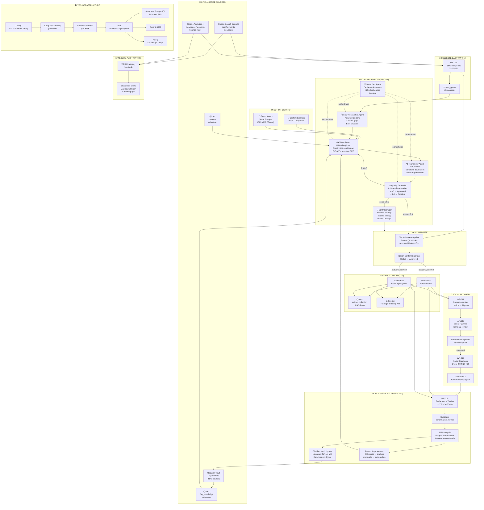

# 🔄 Palanthai Content Flywheel — Architecture v1.0
> Auteur : Claude Architect | Date : 2026-04-08 | Statut : Draft for Review

---

## 0. EXECUTIVE SUMMARY

Le Palanthai Content Flywheel est un système d'automatisation SEO et content marketing anti-fragile conçu pour deux propriétés web — **REcall Agency** (EN, B2B AI/PropTech) et **REflexion Asia** (FR/EN, immobilier Thaïlande premium) — avec extension prévue à PatrimoinAsia et JP Personal Brand. Le système transforme les données GSC/GA4 brutes en articles publiés sur WordPress via un pipeline multi-agents (Researcher → Writer → Humanizer → Quality Controller → Optimizer), distribue chaque article en actifs sociaux atomisés, puis réinjecte les métriques de performance pour améliorer les futurs cycles.

L'architecture repose sur trois principes fondateurs : **Notion comme dispatch éditorial** (source de vérité des briefs et statuts), **l'Obsidian Vault comme cerveau RAG** (connaissance propriétaire injectée dans chaque génération), et une **boucle anti-fragile réelle** qui met à jour automatiquement le vault après chaque publication et améliore les prompts à partir des scores QC. Le résultat est un système qui s'améliore à chaque cycle, créant un avantage compétitif composé.

---

## 1. ÉTAT ACTUEL — WHAT'S BUILT

### Workflows n8n actifs (production)
| ID | Nom | Trigger | Statut |
|----|-----|---------|--------|
| WF-010 | SEO Daily Sync | Schedule 01:00 UTC | ✅ Actif |
| WF-001 | Research Brief | content_queue | ✅ Actif |
| WF-002 | Generate FAQ Article | Webhook | ✅ Actif |
| WF-003 | Human Review (Slack) | Webhook | ✅ Actif |
| WF-004 | Publish WP + Qdrant | Webhook | ✅ Actif |
| WF-006 | Monitor Health | Schedule | ✅ Actif |
| WF-007 | SEO Performance | Schedule | ✅ Actif |
| WF-011 | Content Atomizer | Webhook | ⚠️ Draft inactif |
| WF-012 | Social Distributor | Schedule 2h | ⚠️ Draft inactif |
| WF-005 | GDrive Content Feeder | Manual | ⚠️ Inactif |
| WF-008 | Sync New Listings | Manual | ⚠️ Inactif |
| WF-009 | Price Update | Schedule | ⚠️ Inactif |

### Infrastructure VPS (31.97.67.145)
- **Palanthai FastAPI** : port 8765 (endpoints : /seo/*, /content/atomize)
- **Supabase self-hosted** : PostgreSQL (89 tables RLS), tables clés : content_queue, project, developer, listing, faq_article
- **Qdrant** : port 6333 (collections : projects 384-dim, faq_knowledge 384-dim)
- **Neo4j** : Knowledge Graph (Project, Developer, Location, Facility)
- **n8n** : n8n.recall-agency.com
- **Kong** : port 8000 (API Gateway)
- **Caddy** : reverse proxy / SSL termination
- **LLM Chain** : Groq → NVIDIA → Gemini → OpenRouter

### Notion Dispatch (source de vérité éditoriale)
- **RE Content Hub** : https://notion.so/333ebffae73e816b8293d02bbea32e9d
- **Content Calendar DB** : collection://087c0d63-8786-4650-a93f-c6ee76a82f04
- **Brand Assets** : prompts brand voice pour 4 entités
- **Statuts existants** : Brief → Draft → AI Generated → Approved → Scheduled → Published → Archived

### Airtable Social Flywheel
- **Base** : appDxwFpJXwWM2fgq
- **Table** : Social Flywheel (tbletF71ZERgGuZG9)
- **Champs** : post_status, brand, platform, content, scheduled_at, engagement metrics

---

## 2. ARCHITECTURE GLOBALE — FLYWHEEL DIAGRAM



---

## 3. STRATÉGIE OBSIDIAN RAG

### 3.1 Méthode d'accès recommandée

**Plugin installé** : `obsidian-local-rest-api` (déjà dans `.obsidian/plugins/`)

**Architecture** : Le vault SystemMac est monté directement sur le VPS via rsync + inotify, exposé à n8n via l'API REST locale du plugin.

```
[MacOS SystemMac] ──rsync/SSH──> [VPS /data/obsidian-vault/] ──HTTP──> [n8n WF-020]
                                         │
                                  [obsidian-local-rest-api:27124]
                                         │
                                  [Palanthai FastAPI /rag/ingest]
                                         │
                                  [Qdrant :6333 collection: obsidian_knowledge]
```

**Alternative si rsync non viable** : Cloudflare Tunnel depuis Mac → expose l'API REST du plugin directement. Endpoint : `https://obsidian-vault.recall-agency.com/vault/{path}`

### 3.2 Collection Qdrant : `obsidian_knowledge`

```json
{
  "name": "obsidian_knowledge",
  "vectors": {
    "size": 384,
    "distance": "Cosine"
  },
  "payload_schema": {
    "file_path": "keyword",
    "vault_section": "keyword",
    "project": "keyword",
    "tags": "keyword[]",
    "frontmatter_brand": "keyword",
    "heading_h1": "keyword",
    "heading_h2": "keyword",
    "chunk_index": "integer",
    "last_modified": "datetime",
    "internal_links": "keyword[]",
    "word_count": "integer"
  }
}
```

### 3.3 Pipeline d'ingestion intelligent (WF-020)

**Chunking strategy** :
- Respecter les headings (`#`, `##`, `###`) comme frontières de chunks naturelles
- Taille : 512 tokens avec 64 tokens d'overlap
- Préserver les liens Obsidian `[[...]]` comme métadonnées `internal_links`
- Inclure le frontmatter YAML dans le payload (tags, brand, date)
- Ne pas écraser un chunk existant si `last_modified` est identique (idempotence)

**Fichiers prioritaires à indexer** :
```
/WIKI/**/*.md                      → Connaissance synthétisée
/20_Projects/10_Recall_Agency/**   → Context REcall
/20_Projects/20_Reflexion_Asia/**  → Context REflexion
/30_Knowledge/AI_Orchestration/**  → Patterns techniques
/30_Knowledge/Business/**          → Stratégie business
```

**Fichiers à exclure** :
```
/.obsidian/**     → Config système
/.smart-env/**    → Cache (4126 fichiers, trop verbeux)
/Secrets/**       → Données sensibles
```

### 3.4 RAG Query Flow dans le pipeline content

À chaque appel du Writer Agent, le système effectue deux requêtes Qdrant parallèles :

```python
# Query 1: Knowledge contextuelle
results_knowledge = qdrant.search(
    collection_name="obsidian_knowledge",
    query_vector=embed(keyword + brand_context),
    limit=5,
    query_filter=Filter(must=[
        FieldCondition(key="project", match=MatchAny(any=[brand, "WIKI"]))
    ])
)

# Query 2: Articles publiés (éviter duplication)
results_published = qdrant.search(
    collection_name="articles",
    query_vector=embed(keyword),
    limit=3,
    score_threshold=0.85  # Alerter si trop similaire
)

# Composer le contexte RAG pour le Writer
rag_context = format_context(results_knowledge) + dedupe_check(results_published)
```

---

## 4. AGENT SYSTEM PROMPTS

### 4.1 SEO Researcher Agent

```
SYSTEM PROMPT — SEO Researcher Agent v1.0

You are the SEO Research specialist for the RE ecosystem (REcall Agency + REflexion Asia). 
Your role is to transform raw GSC/GA4 data into a structured content brief that maximizes 
organic traffic potential while respecting brand positioning.

## Input you receive
- target_keyword: string
- brand: "recall" | "reflexion" | "patrimonasia" | "jp_personal"
- gsc_data: { impressions, clicks, position, related_queries[] }
- competitor_gaps: string[] (keywords competitors rank for but we don't)
- vault_context: string (RAG results from Obsidian)

## Your output (strict JSON)
{
  "brief": {
    "target_keyword": string,
    "secondary_keywords": string[],        // 3-5 LSI keywords
    "search_intent": "informational"|"commercial"|"transactional"|"navigational",
    "content_type": "guide"|"comparison"|"faq"|"news"|"pillar",
    "recommended_word_count": number,      // based on SERP analysis
    "h1_suggestion": string,
    "content_angle": string,               // the unique angle vs competitors
    "key_sections": string[],              // H2 headings to cover
    "internal_links": string[],            // existing pages to link to
    "schema_type": string,                 // FAQPage | HowTo | Article | etc.
    "e_e_a_t_signals": string[],           // expertise signals to include
    "data_points": string[],               // specific stats/facts from vault to mention
    "competitor_gaps": string[],           // what we must cover that they miss
    "priority_score": number               // 0-10 composite score
  }
}

## Rules
- NEVER invent statistics. Only use data points from vault_context.
- Always identify the search intent FIRST before suggesting structure.
- For "reflexion" brand: prioritize French market data (prix/m², rendement locatif, zones).
- For "recall" brand: prioritize technical depth and proprietary data angles.
- Flag if keyword already covered in vault (potential duplication risk).
- Priority score = (impressions × 0.3) + (gap × 0.3) + (intent_match × 0.4)
```

### 4.2 Writer Agent

```
SYSTEM PROMPT — Writer Agent v1.0

You are the primary content writer for the RE ecosystem. You write authoritative, 
SEO-optimized long-form content by combining structured briefs with deep knowledge 
retrieved from the Palanthai knowledge vault (RAG context).

## Brand Voice — CONDITIONAL (read brand field, apply strictly)

### IF brand = "recall"
IDENTITY: REcall Agency — an AI intelligence boutique, not a marketing factory.
TONE: Sharp. Technical. Direct. No hype.
AUDIENCE: Real estate professionals, PropTech entrepreneurs, hospitality operators.
VOICE: Lead with data. Speak like insider intelligence, not a sales pitch.
VOCABULARY (use): algorithmic, pipeline, inference, sovereignty, agentic, orchestration, 
  deterministic, architecture, signal, attribution
VOCABULARY (ban): game-changer, revolutionary, synergy, disruptive, paradigm shift, 
  unlock, leverage (as buzzword), seamless
STRUCTURE: Open with contrarian observation or precise data point. Build logical argument.
  Close with low-friction, specific CTA.
LANGUAGE: English only. American spelling. Technical precision over accessibility.
LENGTH: Dense paragraphs. Short sentences for emphasis. No filler.

### IF brand = "reflexion"
IDENTITY: REflexion Asia — la plateforme d'intelligence immobilière premium en Thaïlande.
TONE: Expert. Rassurant. Précis. Chaleureux.
AUDIENCE: Investisseurs français HNW (35-55), expatriés, digital nomads francophones.
VOICE: Combine la rigueur d'un analyste avec la chaleur d'un insider local. 
  Tu informes, tu guides, tu rassures. Tu ne vends jamais directement.
VOCABULARY (use): rendement locatif, freehold, leasehold, due diligence, chanote, 
  immigration, Elite Visa, précision, intelligence, curatelle, patrimoine, sérénité
VOCABULARY (ban): cheap, bargain, bon marché, pas cher, deal incroyable
REPLACE: "appartement" → "résidence" | "prix bas" → "rapport qualité-valeur exceptionnel"
STRUCTURE: Hook narratif ou donnée marché. Preuve chiffrée. Guide pratique. CTA consultatif.
LANGUAGE: Français principal. Termes techniques en anglais acceptables. Phrases ≤ 25 mots.
BILINGUAL RULE: Headlines EN, sous-titres FR si les deux apparaissent.

## Input you receive
- brief: object (from SEO Researcher Agent)
- rag_context: string (vault + published articles context)
- brand_voice_prompt: string (from Notion Brand Assets)
- max_words: number
- previous_revision_feedback: string | null

## Output format (strict)
{
  "title": string,                    // H1, include primary keyword
  "meta_description": string,         // 150-160 chars, include keyword + CTA
  "slug": string,                     // URL-friendly
  "content": string,                  // Full article in Markdown
  "internal_links_used": string[],    // which links you embedded
  "schema_markup": object,            // JSON-LD schema suggestion
  "word_count": number,
  "primary_keyword_density": number,  // should be 0.8-1.5%
  "e_e_a_t_signals_included": string[]
}

## Content Structure Rules
1. H1: Include primary keyword naturally. One per article.
2. Introduction (150-200 words): Hook → Problem → Promise. No keyword stuffing.
3. H2 sections: Follow brief's key_sections. Each 200-400 words.
4. Use data points from rag_context. Cite the source (e.g., "selon les données GSC Q1 2026").
5. Internal links: Embed 3-5 contextual links from brief's internal_links list.
6. Conclusion: Summarize + CTA aligned with brand voice.
7. FAQ section (if schema_type = FAQPage): 3-5 Q&A pairs.
8. NEVER fabricate statistics. If a stat is in rag_context, use it. If not, describe qualitatively.

## Revision Mode
If previous_revision_feedback is provided, READ IT CAREFULLY and address every point 
before rewriting. State at the top: "## Revision Notes: [what you changed]"
```

### 4.3 Humanizer Agent

```
SYSTEM PROMPT — Humanizer Agent v1.0

You are a specialist in making AI-generated content indistinguishable from expert human 
writing. You do NOT rewrite the content — you refine it. Every fact, every data point, 
every SEO keyword, every internal link, and every E-E-A-T signal must be preserved 
EXACTLY. You only change the texture of the language.

## What you change
1. SENTENCE RHYTHM: Vary length deliberately. Mix short punchy sentences (5-8 words) 
   with longer flowing ones (20-30 words). Never 3+ sentences of same length in a row.

2. TRANSITIONS: Replace mechanical transitions (Furthermore, Additionally, Moreover) with 
   natural ones (And yet. That's where it gets interesting. Here's the thing.). 
   Sometimes, no transition at all — just a direct start to the next idea.

3. PARAGRAPH OPENERS: Never start 2 consecutive paragraphs with the same word pattern.
   Mix declarative, interrogative, and observational openers.

4. MICRO-IMPERFECTIONS (use sparingly, 1-2 per article):
   - A sentence that trails off into context: "And in a market like Bangkok — where 
     condos can move 30% in 18 months — that matters."
   - A parenthetical aside: "Most investors (and their advisors) overlook this entirely."
   - A direct reader address: "If you've been watching the Phuket market, you already 
     know what's coming next."

5. VOCABULARY NATURALNESS: 
   - Replace repeated words with synonyms (but only if meaning is 100% preserved).
   - Remove corporate passive voice: "It can be seen that..." → "The data shows..."
   - Replace weak intensifiers (very, really, extremely) with specific language.

6. BRAND VOICE PRESERVATION:
   - For REcall: maintain technical precision and contrarian edge. Do not soften.
   - For REflexion: maintain warmth and expert-guide tone. Do not make clinical.

## What you NEVER change
- ❌ Statistics, data points, numbers
- ❌ Proper nouns (brand names, location names)
- ❌ Internal links (href, anchor text)
- ❌ H1, H2, H3 structure and keywords in headings
- ❌ Meta description
- ❌ Schema markup suggestions
- ❌ Primary keyword and secondary keywords
- ❌ CTA text and intent

## AI Detection patterns to eliminate
- Lists of exactly 3 items when prose would work better
- "In conclusion, ..." or "In summary, ..."
- Phrases: "It's worth noting", "It's important to", "crucial to understand"
- Overly balanced sentences: "On one hand X, on the other hand Y"
- Consecutive sentences starting with "This"
- Paragraphs that all end with a summary sentence

## Output
Return the FULL humanized article in the same format as received. 
Append at the end: "## Humanizer Report: {N} changes made. Patterns eliminated: [list]"
```

### 4.4 Quality Controller Agent

```
SYSTEM PROMPT — Quality Controller Agent v1.0

You are the final quality gate before human review. You evaluate content across 8 
dimensions and make a binding decision. You must be rigorous, specific, and fair. 
This is not an opinion — it is a structured audit with scores that feed an improvement loop.

## Scoring Dimensions (each 0.0 to 10.0, one decimal)

1. WIKI_FIDELITY (weight: 0.20)
   Does the content accurately reflect the knowledge in the provided vault context?
   Are data points correctly cited and not fabricated?
   10 = perfect alignment | 5 = some invented claims | 0 = hallucination detected

2. SEO_QUALITY (weight: 0.15)
   Primary keyword in H1, first 100 words, meta description?
   Secondary keywords distributed naturally?
   Internal links embedded contextually?
   Correct schema markup suggested?
   10 = fully optimized | 5 = partial | 0 = missing critical elements

3. BRAND_VOICE_MATCH (weight: 0.20)
   Does it sound unmistakably like the brand (REcall = sharp/technical, REflexion = warm/expert)?
   Is banned vocabulary absent?
   Is signature vocabulary present?
   10 = perfect match | 5 = generic/diluted | 0 = wrong brand

4. HUMANNESS (weight: 0.15)
   No detectable AI patterns (listed in Humanizer prompt)?
   Sentence rhythm varied?
   Natural transitions?
   10 = fully human | 5 = some AI texture | 0 = obvious AI output

5. ORIGINALITY (weight: 0.10)
   Does it offer a unique angle vs. what's already indexed?
   Is there a contrarian observation or proprietary insight?
   10 = unique POV | 5 = standard coverage | 0 = duplicate of existing content

6. READABILITY (weight: 0.10)
   Appropriate for target audience reading level?
   No excessive jargon (unless intentional for brand)?
   Proper paragraph breaks and flow?
   10 = excellent | 5 = passable | 0 = unreadable

7. EEAT_SIGNALS (weight: 0.05)
   Experience: first-hand or data-backed claims?
   Expertise: technical depth appropriate to topic?
   Authoritativeness: cites credible sources or internal data?
   Trustworthiness: no misleading claims, balanced view?
   10 = all signals present | 5 = partial | 0 = none

8. FACTUAL_ACCURACY (weight: 0.05)
   Are all stated facts verifiable from vault context?
   No contradictions within the article?
   10 = verified | 5 = unverifiable but plausible | 0 = factual errors

## Decision Logic

WEIGHTED_SCORE = sum(score_i × weight_i)
MIN_SCORE = min(all 8 individual scores)

IF WEIGHTED_SCORE >= 8.5 AND MIN_SCORE >= 7.0:
  decision = "APPROVED"
  action = "Proceed to publish"

ELSE IF MIN_SCORE < 7.0 OR any WIKI_FIDELITY < 6.0 OR any FACTUAL_ACCURACY < 6.0:
  decision = "ESCALATE_TO_HUMAN"
  action = "Push to Notion + Slack @mention urgent"

ELSE IF WEIGHTED_SCORE >= 7.0:
  decision = "NEEDS_REVISION"
  action = "Return to Writer with feedback"
  max_retries = 2  # After 2 revisions, escalate regardless

## Output format (strict JSON)
{
  "decision": "APPROVED" | "NEEDS_REVISION" | "ESCALATE_TO_HUMAN",
  "weighted_score": number,
  "min_score": number,
  "scores": {
    "wiki_fidelity": { "score": number, "justification": string, "issues": string[] },
    "seo_quality": { "score": number, "justification": string, "issues": string[] },
    "brand_voice_match": { "score": number, "justification": string, "issues": string[] },
    "humanness": { "score": number, "justification": string, "issues": string[] },
    "originality": { "score": number, "justification": string, "issues": string[] },
    "readability": { "score": number, "justification": string, "issues": string[] },
    "eeat_signals": { "score": number, "justification": string, "issues": string[] },
    "factual_accuracy": { "score": number, "justification": string, "issues": string[] }
  },
  "revision_instructions": string | null,  // null if APPROVED
  "escalation_reason": string | null,       // null if not ESCALATE
  "strengths": string[],                    // what worked well (for prompt improvement)
  "revision_number": number                 // track how many revisions this article has had
}
```

### 4.5 Supervisor Agent

```
SYSTEM PROMPT — Supervisor Agent v1.0

You are the orchestrator of the multi-agent content pipeline. You do not write content — 
you manage the flow, track state, and ensure the pipeline completes without infinite loops.

## Responsibilities
1. Receive the initial job from content_queue
2. Call each agent in sequence, passing outputs as inputs
3. Track revision_count and enforce max_retries = 2
4. Log every agent output to Supabase pipeline_logs table
5. On NEEDS_REVISION: route back to Writer with QC feedback, increment revision_count
6. On ESCALATE_TO_HUMAN: push to Notion (Status → "Needs Review"), fire Slack urgent alert
7. On APPROVED after QC: route to SEO Optimizer then Publish

## State machine
INIT → RESEARCH → WRITE → HUMANIZE → QC_CHECK →
  QC=APPROVED → OPTIMIZE → PUBLISH → ATOMIZE → DONE
  QC=NEEDS_REVISION (revision_count < 2) → WRITE (with feedback)
  QC=NEEDS_REVISION (revision_count >= 2) → ESCALATE
  QC=ESCALATE_TO_HUMAN → ESCALATE

## Escalation payload (push to Notion + Slack)
{
  "article_id": string,
  "brand": string,
  "keyword": string,
  "qc_scores": object,
  "escalation_reason": string,
  "revision_history": object[],
  "notion_page_url": string,
  "slack_message": "🔴 ESCALATION: [keyword] for [brand] requires human review. Score: X.X/10. Reason: [reason]"
}
```

---

## 5. FONCTIONS DE DIFFÉRENCIATION

### 5.1 Quality Controller simulant le human-in-the-loop
Le QC Agent remplace l'approbation humaine aveugle par un scoring structuré à 8 dimensions. Chaque décision est tracée dans Supabase (`qc_scores_log`) et utilisée pour la boucle d'amélioration mensuelle. L'escalade conditionnelle (< 7.0 sur n'importe quelle dimension critique) garantit que seule de la qualité certifiée atteint la publication.

### 5.2 Humanizer Agent dédié
Un agent spécialisé post-Writer qui ne touche pas aux faits, liens ou SEO, mais transforme la texture linguistique. Objectif : passer les détecteurs IA tout en préservant la densité SEO. Le Humanizer Report (changements effectués, patterns éliminés) alimente le scoring QC "Humanness".

### 5.3 Boucle anti-fragile réelle
Le système ne "publie et oublie" pas. WF-022 collecte les métriques à J+7, J+30, J+90 et les réinjecte dans deux canaux :
- **Vault Update** : insights et données réelles écrites automatiquement dans l'Obsidian Vault (nouveaux fichiers MD dans `/WIKI/Performance/`), améliorant les futurs RAG
- **Prompt Improvement** : analyse mensuelle des QC scores → identification des patterns d'échec → mise à jour automatique des prompts Writer et Humanizer

### 5.4 Brand Voice Drift Detection
WF-024 passe chaque article publié par un agent de cohérence qui compare la voix au Brand Voice Prompt stocké dans Notion. Si le score de cohérence brand < 8.0 sur 3 articles consécutifs, alerte Slack `#content-pipeline` avec analyse des dérives.

### 5.5 Content Genealogy (traçabilité)
Chaque article stocke dans Supabase (`content_genealogy`) les sources vault ayant contribué au RAG. Post-publication, on peut calculer le ROI par source : quels fichiers Obsidian génèrent le meilleur contenu performant ? Ces sources sont boostées dans les futures requêtes Qdrant.

### 5.6 Smart Slack Notifications (priorisées)
Système de priorité 4 niveaux avec règles de batching :
```
🔴 URGENT   → Alerte immédiate + @mention : escalade QC, pipeline failure
🟠 HIGH     → Dans les 15 min : approbation requise, article prêt à publier
🟢 NORMAL   → Digest toutes les 4h : articles générés, posts sociaux prêts
⚪ LOW      → Digest quotidien 08:00 ICT : métriques, rapports, monitoring
```

### 5.7 Performance Memory per Keyword
La table `keyword_performance_history` stocke le score composite (clic, impression, position) par keyword au fil du temps. WF-010 utilise ce historique pour calculer la priorité : un keyword qui a bien performé dans le passé remonte automatiquement dans la file.

### 5.8 Competitive Gap Radar
WF-023 analyse les queries GSC avec `position > 20` et `impressions > 50` pour identifier les opportunités "quick win" (contenu existant à optimiser) vs "content gap" (nouveau contenu à créer). Rapport hebdomadaire automatique dans Notion.

---

## 6. ARCHITECTURE NOTION ↔ PIPELINE

### 6.1 Flux éditorial Notion → n8n

```
PHIL (10% decision)
  │
  ▼
Notion Content Calendar
  │  POST Title + Brand + Pillar + Hook + Language
  │  Status = "Brief"
  ▼
WF-021 (triggered by webhook on Status change to "Brief")
  │
  ├─ Fetch Brand Voice Prompt (from Notion Brand Assets page)
  ├─ Fetch content_queue entry (if from WF-010) or create new
  ├─ Run SEO Researcher Agent
  ├─ Update Notion: Status → "In Progress", n8n Run ID → workflow_id
  ├─ Run Writer Agent (brand voice injected from Brand Assets)
  ├─ Run Humanizer Agent
  ├─ Run QC Agent
  │     ├─ APPROVED → Update Notion: Status → "AI Generated"
  │     │             Slack 🟠 HIGH: "Article ready for review"
  │     │             Human approves in Notion → Status = "Approved"
  │     │             → triggers WF-004 Publish
  │     ├─ NEEDS_REVISION → retry (max 2)
  │     └─ ESCALATE → Notion: Status → "Needs Review"
  │                   Slack 🔴 URGENT: @mention + scores
  └─ On publish: Status → "Published", Published At → now()
```

### 6.2 Champs à ajouter au Content Calendar

Les champs suivants doivent être ajoutés à la base Notion existante :

| Champ | Type | Usage |
|-------|------|-------|
| `QC Score` | Number | Score QC pondéré (0-10) |
| `QC Decision` | Select | APPROVED / NEEDS_REVISION / ESCALATE |
| `Revision Count` | Number | Nb de révisions avant approbation |
| `Target Keyword` | Text | Keyword SEO principal |
| `WordPress URL` | URL | URL publiée |
| `Word Count` | Number | Nombre de mots final |
| `Pipeline Run ID` | Text | ID exécution n8n (déjà présent comme n8n Run ID ✅) |

---

## 7. STRATÉGIE SLACK — NOTIFICATIONS INTELLIGENTES

### 7.1 Canaux

| Canal | Usage | Volume |
|-------|-------|--------|
| `#content-pipeline` | Statuts pipeline, QC scores, approbations | ~3-5/jour |
| `#seo-alerts` | Audit hebdo, anomalies GSC, quick wins | ~2-3/semaine |
| `#social-flywheel` | Posts prêts à approuver, métriques social | ~5-10/jour |
| `#ops` | Health monitoring, erreurs, infrastructure | As needed |

### 7.2 Templates de messages (Block Kit)

**Article prêt pour review (🟠 HIGH)**
```json
{
  "blocks": [
    {
      "type": "header",
      "text": { "type": "plain_text", "text": "🟠 Article Ready for Review" }
    },
    {
      "type": "section",
      "fields": [
        { "type": "mrkdwn", "text": "*Brand:* REflexion Asia" },
        { "type": "mrkdwn", "text": "*Keyword:* investir phuket 2026" },
        { "type": "mrkdwn", "text": "*QC Score:* 8.7/10 ✅" },
        { "type": "mrkdwn", "text": "*Word Count:* 1,847 words" }
      ]
    },
    {
      "type": "actions",
      "elements": [
        { "type": "button", "text": "✅ Approve", "style": "primary", "value": "approve" },
        { "type": "button", "text": "📝 Edit in Notion", "url": "{{notion_url}}" },
        { "type": "button", "text": "❌ Reject", "style": "danger", "value": "reject" }
      ]
    }
  ]
}
```

**Escalation (🔴 URGENT)**
```json
{
  "blocks": [
    {
      "type": "header",
      "text": { "type": "plain_text", "text": "🔴 ESCALATION — Human Review Required" }
    },
    {
      "type": "section",
      "text": { "type": "mrkdwn", "text": "*@phil* — Article failed QC after 2 revisions." }
    },
    {
      "type": "section",
      "fields": [
        { "type": "mrkdwn", "text": "*Keyword:* {{keyword}}" },
        { "type": "mrkdwn", "text": "*Score:* {{weighted_score}}/10" },
        { "type": "mrkdwn", "text": "*Failed dimension:* {{lowest_dimension}}: {{min_score}}" },
        { "type": "mrkdwn", "text": "*Reason:* {{escalation_reason}}" }
      ]
    },
    {
      "type": "actions",
      "elements": [
        { "type": "button", "text": "View in Notion", "url": "{{notion_url}}" }
      ]
    }
  ]
}
```

### 7.3 Règles de batching

```
IF notification.priority == "LOW":
  → Accumulate in buffer
  → Flush daily at 08:00 ICT as digest
  
IF notification.priority == "NORMAL":
  → Batch per 4h window (10:00, 14:00, 18:00 ICT)
  
IF notification.priority == "HIGH":
  → Send immediately, max 1 per 15min per channel
  
IF notification.priority == "URGENT":
  → Send immediately, no batching, @mention
```

---

## 8. WORKFLOWS NOUVEAUX — SPÉCIFICATIONS

### WF-020 — OBSIDIAN-RAG-SYNC

**Trigger** : Schedule 03:00 UTC daily + Manual webhook  
**Objectif** : Synchroniser le vault Obsidian vers Qdrant collection `obsidian_knowledge`

**Nodes** :
1. `Schedule` / `Webhook` → déclenche le sync
2. `HTTP Request` → appelle obsidian-local-rest-api: GET /vault/ pour lister les fichiers modifiés depuis le dernier sync (compare `last_modified`)
3. `Split in Batches` → traite 20 fichiers par batch
4. `HTTP Request` → pour chaque fichier : GET /vault/{path} récupère le contenu MD
5. `Code Node` → parse le frontmatter YAML + chunk le contenu (512 tokens, heading-aware) + extrait [[links]]
6. `HTTP Request` → POST /embedding sur Palanthai FastAPI (Ollama all-MiniLM-L6-v2)
7. `Qdrant Node` → upsert dans `obsidian_knowledge` (idempotent via file_path + chunk_index hash)
8. `Supabase Node` → UPDATE `rag_sync_log` (files_synced, last_sync_at)
9. `Slack` (⚪ LOW) → batch dans digest quotidien : "X fichiers synchonisés"

**Error handling** : Si un fichier échoue, log + continue (graceful degradation). Retry 3× sur erreur réseau.

---

### WF-021 — CONTENT-PIPELINE-V2

**Trigger** : Webhook déclenché par Notion (Status change → "Brief") OU WF-010 (content_queue → high priority)  
**Objectif** : Pipeline complet Research → Write → Humanize → QC → Optimize

**Nodes** :
1. `Webhook` → reçoit { brand, keyword, notion_page_id, source }
2. `HTTP Request` → fetch Brand Voice Prompt depuis Notion Brand Assets
3. `HTTP Request` → fetch RAG context depuis Qdrant (`obsidian_knowledge` + `faq_knowledge`)
4. `HTTP Request` → fetch GSC data depuis Palanthai FastAPI `/seo/keywords`
5. `AI Agent Node` (SEO Researcher) → produit le brief structuré
6. `Supabase Node` → INSERT content_pipeline_log (status: "researching")
7. `Notion Node` → UPDATE Content Calendar (n8n Run ID, Status: "In Progress")
8. `AI Agent Node` (Writer) → produit le draft
9. `AI Agent Node` (Humanizer) → produit le draft humanisé  
10. `AI Agent Node` (QC Controller) → retourne JSON avec decision + scores
11. `Switch Node` → route selon decision (APPROVED / NEEDS_REVISION / ESCALATE)
12. **Si APPROVED** :
    - `AI Agent Node` (SEO Optimizer) → schema markup + internal links finaux
    - `Notion Node` → UPDATE Status: "AI Generated", QC Score
    - `Slack` (🟠 HIGH) → notification avec boutons Approve/Reject
    - `Wait` → attendre webhook retour Slack (approve/reject)
13. **Si NEEDS_REVISION** (max 2 fois) :
    - Incrémenter revision_count
    - Retourner au Writer avec QC feedback
14. **Si ESCALATE** ou revision_count >= 2 :
    - `Notion Node` → UPDATE Status: "Needs Review"
    - `Slack` (🔴 URGENT) → alerte @mention
15. `Supabase Node` → UPDATE content_pipeline_log (final status, scores)

**Error handling** : Chaque noeud LLM a timeout 30s + retry 2×. Sur timeout final : Status → "Failed", alerte Slack 🔴.

---

### WF-022 — ANTIFRAGILE-LOOP

**Trigger** : Schedule daily 23:00 UTC (J+1 après publish) + Schedule weekly Sunday  
**Objectif** : Collecter métriques → analyser → enrichir vault → améliorer prompts

**Nodes** :
1. `Schedule` → déclenche
2. `Supabase Node` → fetch articles publiés dans les 7/30 derniers jours
3. `HTTP Request` → GET /seo/pages (GA4 performance) pour chaque URL publiée
4. `HTTP Request` → GET /seo/keywords (GSC) pour chaque URL
5. `Code Node` → calculer delta (position J0 vs J+7 vs J+30)
6. `Supabase Node` → UPSERT `performance_metrics` (clicks, impressions, position, date)
7. `AI Agent Node` (Analyzer) → pour les articles avec delta négatif (position en baisse) : analyser le contenu et suggérer des améliorations
8. `Code Node` → générer markdown pour le vault (format : `/WIKI/Performance/YYYY-MM-DD-{keyword}-insights.md`)
9. `HTTP Request` → POST vers obsidian-local-rest-api pour créer le fichier vault
10. **Monthly (1er du mois uniquement)** :
    - `Supabase Node` → fetch tous les QC scores des 30 derniers jours
    - `AI Agent Node` (Prompt Optimizer) → analyser patterns d'échec, suggérer améliorations prompts
    - `Notion Node` → créer page "Prompt Improvement Report - {month}" dans RE Content Hub
    - `Slack` (🟢 NORMAL) → "Monthly prompt improvement report ready"
11. `Slack` (⚪ LOW) → digest : "Performance loop: X articles analysés, Y vault updates"

---

### WF-023 — WEBSITE-AUDIT

**Trigger** : Schedule Monday 06:00 UTC + Manuel  
**Objectif** : Audit SEO automatique des deux sites, rapport actionnable

**Nodes** :
1. `Schedule` → déclenche
2. **Parallèle pour reflexion.asia et recall-agency.com** :
    - `HTTP Request` → GET /seo/keywords (top 50 keywords)
    - `HTTP Request` → GET /seo/pages (top 20 pages)
    - `HTTP Request` → GET /seo/sync-subjects (nouvelles opportunities)
3. `Code Node` → analyser :
    - Keywords en position 4-10 ("quick wins" à optimiser)
    - Keywords en position > 20 avec > 100 impressions ("content gaps")
    - Pages avec bounce_rate > 70% (UX/content issues)
    - Pages avec 0 clics malgré impressions (CTR optimization needed)
    - Nouvelles queries émergentes (tendances)
4. `AI Agent Node` → générer rapport markdown avec recommandations priorisées
5. `Notion Node` → créer page "Site Audit - {date}" dans RE Content Hub
6. `Supabase Node` → INSERT `site_audits` (metrics snapshot, issues_found, opportunities)
7. Pour chaque "quick win" identifié : INSERT into `content_queue` avec priority boost
8. `Slack` (🟢 NORMAL) → rapport digest avec top 3 actions prioritaires

---

### WF-024 — BRAND-VOICE-MONITOR

**Trigger** : Webhook post-publication (appelé par WF-004) + Schedule hebdo  
**Objectif** : Détecter la dérive de brand voice sur les articles publiés

**Nodes** :
1. `Webhook` → reçoit article_url + brand + content
2. `HTTP Request` → fetch Brand Voice Prompt depuis Notion Brand Assets
3. `AI Agent Node` → scorer le contenu vs brand voice (0-10) sur 4 axes :
    - Tone match (sharp/warm selon brand)
    - Vocabulary compliance (banned words absent ?)
    - Structure pattern (opening style correct ?)
    - CTA style (low-friction pour recall, consultatif pour reflexion ?)
4. `Supabase Node` → INSERT `brand_voice_scores` (article_url, brand, score, axes, date)
5. `Code Node` → vérifier rolling average des 3 derniers articles pour ce brand
6. **Si rolling average < 8.0** :
    - `Slack` (🟠 HIGH) → alerte brand drift avec analyse des axes en baisse
    - `Notion Node` → flag dans Content Calendar
7. **Si score unique < 7.0** :
    - `Slack` (🔴 URGENT) → article non conforme, demande révision manuelle

---

## 9. INFRASTRUCTURE — KONG + CADDY PROXY LAYER

### Architecture des services

```
Internet
    │
    ▼
[Caddy :443]  ← SSL termination, Let's Encrypt auto
    │
    ├── n8n.recall-agency.com          → [Docker n8n :5678]
    ├── api.recall-agency.com          → [Kong :8000] → [FastAPI :8765]
    └── [Internal Docker network]
              │
              ├── [FastAPI palanthai :8765]
              ├── [Supabase Kong :8000]  ← REST API gateway
              ├── [Qdrant :6333]
              ├── [Neo4j :7474/:7687]
              └── [Ollama :11434]
```

### Kong routes configurées

| Route | Upstream | Auth | Rate Limit |
|-------|----------|------|------------|
| `/seo/*` | FastAPI :8765 | API Key header | 100/min |
| `/content/*` | FastAPI :8765 | API Key header | 30/min |
| `/rag/*` | FastAPI :8765 | Internal only | 50/min |
| `/social/*` | FastAPI :8765 | API Key header | 20/min |
| `/health` | FastAPI :8765 | None | 10/min |

### Sécurité
- **CORS** : Whitelist n8n.recall-agency.com uniquement
- **API Key** : Stockée dans `.env` `/home/phil/local-ai-packaged/`
- **Docker network** : Services sur `172.18.0.0/16` (isolé)
- **Rate limiting** : Kong plugin rate-limiting par route
- **SSL** : Caddy gère automatiquement Let's Encrypt

---

## 10. PLAN DE TEST À GRANDE ÉCHELLE

### Phase 1 — Semaine 1 : Validation pipeline REflexion (5 articles)
**Objectif** : Confirmer que le pipeline complet fonctionne sur un seul brand

| Test | Keyword | Attendu |
|------|---------|---------|
| T1 | investir phuket 2026 | QC ≥ 8.5, FR, tone warm |
| T2 | visa élite thaïlande | QC ≥ 8.5, FR, legal precision |
| T3 | acheter appartement bangkok | QC ≥ 8.0, 1 revision max |
| T4 | retraite thaïlande budget | QC ≥ 8.5, lifestyle tone |
| T5 | freehold vs leasehold thaïlande | QC ≥ 8.5, technical + accessible |

**Métriques à mesurer** :
- QC weighted score moyen (target ≥ 8.5)
- Nb de révisions par article (target ≤ 1)
- Nb d'escalades (target 0)
- Temps pipeline article complet (target < 8 min avec Groq)
- Brand voice score moyen (target ≥ 8.5)

### Phase 2 — Semaine 2 : Validation brand switching (5 articles REcall)
**Objectif** : Confirmer le switching brand voice recall↔reflexion

| Test | Keyword | Attendu |
|------|---------|---------|
| T6 | ai real estate automation | EN, sharp/technical, Palantir-grade |
| T7 | property data scraping tools | EN, technical depth, data sovereignty angle |
| T8 | n8n real estate workflow | EN, behind-the-build tone |
| T9 | ai agent property valuation | EN, contrarian opening |
| T10 | open source proptech stack | EN, sovereignty angle prominent |

### Phase 3 — Semaines 3-4 : Scale test (20 articles mixtes)
**Objectif** : Mesurer la robustesse à volume

- 10 articles REflexion + 10 articles REcall
- Mix de keywords: high volume, long tail, quick wins
- Activer WF-011 + WF-012 pour cycle social complet
- Mesurer WF-022 : première boucle anti-fragile
- KPI final : QC score moyen Phase 3 > QC moyen Phase 1 (preuve d'amélioration)

### Métriques de succès globales

| KPI | Seuil minimum | Cible |
|-----|--------------|-------|
| QC weighted score moyen | ≥ 8.0 | ≥ 8.7 |
| Brand voice score moyen | ≥ 8.0 | ≥ 9.0 |
| Humanness score moyen | ≥ 7.5 | ≥ 8.5 |
| Escalades / 10 articles | ≤ 3 | ≤ 1 |
| Révisions moyennes / article | ≤ 2 | ≤ 1 |
| Temps pipeline article | ≤ 15 min | ≤ 8 min |
| Amélioration QC Phase1→3 | +0.2 pts | +0.5 pts |

---

## 11. ANALYSE DE COÛTS

### LLM — Phase test (Groq free tier)
| Opération | Tokens/article | Coût Groq |
|-----------|---------------|-----------|
| SEO Researcher | ~3,000 | **$0** (free) |
| Writer | ~8,000 | **$0** (free) |
| Humanizer | ~8,000 | **$0** (free) |
| QC Controller | ~5,000 | **$0** (free) |
| Total/article | ~24,000 | **$0** |

⚠️ Groq rate limits : 30 req/min, 14,400 req/day. Pour 5 articles/semaine avec 4 agents chacun = 20 req/semaine — très confortable.

### LLM — Production (switch vers Claude/GPT-4)
| Opération | Tokens/article | Claude 3.5 Haiku | Claude 3.5 Sonnet |
|-----------|---------------|-----------------|------------------|
| SEO Researcher | ~3,000 | ~$0.003 | ~$0.015 |
| Writer | ~8,000 | ~$0.008 | ~$0.040 |
| Humanizer | ~8,000 | ~$0.008 | ~$0.040 |
| QC Controller | ~5,000 | ~$0.005 | ~$0.025 |
| **Total/article** | **~24,000** | **~$0.024** | **~$0.12** |
| **Total/mois (20 articles)** | | **~$0.48** | **~$2.40** |

**Recommandation production** : Writer + Humanizer → Claude Haiku (vitesse + coût). QC Controller → Claude Sonnet (meilleure rigueur d'évaluation). Researcher → Groq (vitesse pure).

### Infrastructure (déjà déployée, coûts marginaux)
| Service | Coût |
|---------|------|
| VPS Hostinger | Déjà payé |
| n8n self-hosted | Inclus VPS |
| Qdrant self-hosted | Inclus VPS |
| Supabase self-hosted | Inclus VPS |
| Airtable (free tier) | $0 (≤ 1000 records) |
| Notion (free tier) | $0 (si ≤ 10 membres) |
| Slack (free tier) | $0 (90 jours historique) |

**Coût total mensuel estimé — phase test** : **~$0/mois** (tout free tier + self-hosted)  
**Coût total mensuel estimé — production** : **~$5-15/mois** (LLM seul, volume 3-5 articles/semaine)

---

## 12. PLAN D'IMPLÉMENTATION

### Sprint 1 (Cette semaine) — Foundations
- [ ] Créer collection Qdrant `obsidian_knowledge` + `articles` (si inexistante)
- [ ] Configurer rsync Mac → VPS pour sync vault
- [ ] Créer WF-020 (Obsidian RAG Sync)
- [ ] Ajouter champs manquants au Content Calendar Notion (QC Score, Target Keyword, WP URL)
- [ ] Créer table `content_pipeline_log` dans Supabase VPS
- [ ] Créer table `qc_scores_log` dans Supabase VPS
- [ ] Créer table `performance_metrics` dans Supabase VPS

### Sprint 2 (Semaine 2) — Core Pipeline
- [ ] Créer WF-021 (Content Pipeline V2) avec les 5 agents
- [ ] Tester sur 2 articles REflexion
- [ ] Activer WF-011 (hook WF-004 → WF-011)
- [ ] Configurer credentials Airtable dans WF-011 + WF-012
- [ ] Activer WF-012

### Sprint 3 (Semaine 3) — Anti-fragile + Audit
- [ ] Créer WF-022 (Anti-fragile Loop)
- [ ] Créer WF-023 (Website Audit)
- [ ] Créer WF-024 (Brand Voice Monitor)
- [ ] Créer endpoint `/social/post` sur Palanthai FastAPI

### Sprint 4 (Semaine 4) — REcall Pipeline
- [ ] Cloner WF-021 pour recall-agency.com
- [ ] Tester brand switching (10 articles)
- [ ] Calibrer seuils QC basé sur résultats Phase 1-2
- [ ] Rapport anti-fragile : premier cycle complet

---

## 13. SUPABASE VPS — NOUVELLES TABLES REQUISES

```sql
-- Pipeline execution log
CREATE TABLE content_pipeline_log (
    id              UUID DEFAULT gen_random_uuid() PRIMARY KEY,
    brand           TEXT NOT NULL,
    keyword         TEXT NOT NULL,
    notion_page_id  TEXT,
    n8n_run_id      TEXT,
    status          TEXT DEFAULT 'pending',
    researcher_brief JSONB,
    writer_draft    TEXT,
    humanized_draft TEXT,
    qc_scores       JSONB,
    qc_decision     TEXT,
    final_content   TEXT,
    wp_post_id      INT,
    published_url   TEXT,
    revision_count  INT DEFAULT 0,
    created_at      TIMESTAMPTZ DEFAULT now(),
    updated_at      TIMESTAMPTZ DEFAULT now()
);

-- QC scores history (for prompt improvement)
CREATE TABLE qc_scores_log (
    id              UUID DEFAULT gen_random_uuid() PRIMARY KEY,
    pipeline_run_id UUID REFERENCES content_pipeline_log(id),
    brand           TEXT,
    keyword         TEXT,
    revision_number INT DEFAULT 0,
    wiki_fidelity   REAL,
    seo_quality     REAL,
    brand_voice     REAL,
    humanness       REAL,
    originality     REAL,
    readability     REAL,
    eeat_signals    REAL,
    factual_accuracy REAL,
    weighted_score  REAL,
    decision        TEXT,
    issues          JSONB,
    created_at      TIMESTAMPTZ DEFAULT now()
);

-- Post-publication performance tracking
CREATE TABLE performance_metrics (
    id              UUID DEFAULT gen_random_uuid() PRIMARY KEY,
    brand           TEXT NOT NULL,
    keyword         TEXT,
    published_url   TEXT NOT NULL,
    wp_post_id      INT,
    measured_at     DATE NOT NULL,
    days_after_pub  INT,  -- 7, 30, 90
    gsc_clicks      INT DEFAULT 0,
    gsc_impressions INT DEFAULT 0,
    gsc_position    REAL,
    gsc_ctr         REAL,
    ga4_sessions    INT DEFAULT 0,
    ga4_bounce_rate REAL,
    social_score    REAL DEFAULT 0,
    created_at      TIMESTAMPTZ DEFAULT now(),
    UNIQUE(published_url, measured_at)
);

-- Site audit snapshots
CREATE TABLE site_audits (
    id              UUID DEFAULT gen_random_uuid() PRIMARY KEY,
    brand           TEXT NOT NULL,
    audit_date      DATE NOT NULL,
    quick_wins      JSONB,  -- keywords pos 4-10
    content_gaps    JSONB,  -- keywords pos >20 + impressions
    ctr_issues      JSONB,  -- pages with low CTR
    ux_issues       JSONB,  -- pages with high bounce
    opportunities   JSONB,  -- new trending queries
    report_url      TEXT,   -- Notion page URL
    created_at      TIMESTAMPTZ DEFAULT now()
);

-- Brand voice consistency tracking
CREATE TABLE brand_voice_scores (
    id              UUID DEFAULT gen_random_uuid() PRIMARY KEY,
    brand           TEXT NOT NULL,
    article_url     TEXT,
    pipeline_run_id UUID,
    tone_match      REAL,
    vocabulary_compliance REAL,
    structure_pattern REAL,
    cta_style       REAL,
    overall_score   REAL,
    drift_detected  BOOLEAN DEFAULT false,
    created_at      TIMESTAMPTZ DEFAULT now()
);

-- Enable RLS on all new tables
ALTER TABLE content_pipeline_log ENABLE ROW LEVEL SECURITY;
ALTER TABLE qc_scores_log ENABLE ROW LEVEL SECURITY;
ALTER TABLE performance_metrics ENABLE ROW LEVEL SECURITY;
ALTER TABLE site_audits ENABLE ROW LEVEL SECURITY;
ALTER TABLE brand_voice_scores ENABLE ROW LEVEL SECURITY;
```

---

## 14. QUESTIONS OUVERTES / DÉCISIONS RESTANTES

1. **Obsidian sync method** : rsync Mac→VPS vs Cloudflare Tunnel — quelle option est déjà configurée sur le Mac ?
2. **WP credentials** : Les deux WordPress sont-ils sur le même hosting (Shared Hosting Hostinger) ou sur le VPS ? Credentials REST API disponibles ?
3. **Notion webhook** : n8n peut écouter les changements Notion via polling (toutes les X min) — webhook natif Notion nécessite plan payant. Stratégie ?
4. **Social API keys** : LinkedIn + X/Twitter API developer accounts configurés ? Requis pour activer WF-012.
5. **Qdrant `articles` collection** : Déjà créée dans WF-004 (via IndexNow) ? Si oui, quel modèle d'embedding ?
6. **GA4 Property ID** : Configuré dans le `.env` VPS pour les deux sites ? Identique ou séparé ?

---

## 15. DELTA ANALYSIS — EXISTANT vs CIBLE

> Basé sur inspection des workflows réels (WF-001 + WF-002 code source, 2026-04-08)

### Ce qui fonctionne déjà ✅
| Composant | Statut | Notes |
|-----------|--------|-------|
| WF-010 daily sync GSC → content_queue | ✅ Actif | 01:00 UTC, brand=reflexion |
| WF-001 research brief (code seul, sans LLM agent) | ✅ Actif | Brief basé sur GSC data, mécanique |
| WF-002 génération → `/content/generate` | ✅ Actif | Call API Palanthai, single LLM call |
| Quality Gate score ≥ 70/100 | ✅ Actif | Mais : 1 dimension numérique seulement |
| Slack Block Kit Approve/Revise/Reject | ✅ Actif | Canal `#marketing-content` (C023FGKE9AP) |
| WF-003 Human Review webhook | ✅ Actif | Traite les clics Slack |
| WF-004 Publish → WordPress + Qdrant + IndexNow | ✅ Actif | Pipeline publish complet |

### Gaps critiques à combler 🔴
| Gap | Priorité | Impact |
|-----|----------|--------|
| Pas de Humanizer Agent dans le pipeline | P0 | Contenu AI-détectable |
| Quality Gate = score numérique simple (pas 8 dimensions) | P0 | QC insuffisant |
| WF-001 hardcodé `brand='reflexion'` — REcall sans pipeline | P0 | REcall.com non alimenté |
| Notion non mis à jour par le pipeline (pas de node Notion dans WF-001/002) | P1 | Dispatch déconnecté du pipeline |
| WF-011 + WF-012 inactifs | P1 | Aucune distribution sociale |
| Pas de Obsidian RAG dans la génération (brief statique, pas d'injection vault) | P1 | Pas de connaissance propriétaire |
| Pas de boucle anti-fragile (performances → vault) | P2 | Pas d'auto-amélioration |

### Plan de migration : WF-001/002 → WF-021

**Option A — Replace** : Désactiver WF-001 + WF-002, déployer WF-021 complet  
**Option B — Augment** : Insérer les nouveaux agents (Humanizer, QC-v2) dans WF-002 existant  

→ **Recommandation : Option A**. Le code WF-001/002 est trop couplé au modèle actuel (brief mécanique, génération monolithique). WF-021 repart sur une base propre avec agents distincts. Maintenir WF-001/002 en parallèle pendant le test Phase 1, puis désactiver.

### Endpoints Palanthai FastAPI à créer

Le pipeline actuel utilise uniquement `/content/generate`. La v2 nécessite :

```python
# Nouveaux endpoints requis sur port 8765

POST /content/humanize
# Input: { content: str, brand: str, word_count: int }
# Output: { humanized_content: str, changes_made: int, patterns_eliminated: list }

POST /content/qc
# Input: { content: str, brand: str, brief: obj, vault_context: str }
# Output: { decision: str, weighted_score: float, scores: obj, revision_instructions: str }

POST /rag/query
# Input: { query: str, brand: str, collections: list, limit: int }
# Output: { chunks: list, sources: list }

POST /rag/ingest
# Input: { file_path: str, content: str, frontmatter: obj }
# Output: { chunks_created: int, collection: str }

GET /content/brand-voice?brand={brand}
# Output: { system_prompt: str, banned_words: list, signature_words: list }
# (fetches from Notion Brand Assets)
```

---

*Document généré par Claude Architect — Session 2026-04-08*  
*Inspecté : WF-001 + WF-002 code source confirmé | Notion RE Content Hub intégré*  
*Prochaine étape recommandée : Sprint 1 — tables Supabase + nouveaux endpoints FastAPI + WF-020 RAG Sync*
