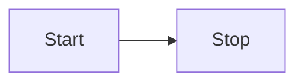

Gemini Mémoire Partagée

Ce dossier sert de mémoire partagée pour nos interactions.

## Structure



graph TD
    A[Gemini-obsinote] --> B[config/]
    A --> C[logs/]
    C --> C1[daily_interactions/]
    A --> D[data/]
    A --> E[projects/]
    A --> F[documents/]
    A --> G[scripts/]
    A --> H[n8n-configs/]
    A --> I[VPS-Config/]
    A --> J[daily/]
    A --> K[Script.py]
    A --> L[Scripts.py]
    A --> M[README.md]
    A --> N[.obsidian/]

    B --> B1[claude_desktop_config.json]
    B --> B2[mcp_servers_config.json]
    B --> B3[qdrant_log.ini]
    B --> B4[supabase_config.json]
    B --> B5[supabase.sql]

    C1 --> C1_1[YYYY-MM-DD.md]

    D --> D1[Raw Data Files (e.g., CSVs)]

    E --> E1[ProjectName/]
    E1 --> E1_1[ProjectName_Overview.md]

    F --> F1[Processed Documents]

    G --> G1[setup_ollama.sh]


    style A fill:#f9f,stroke:#333,stroke-width:2px
    style B fill:#bbf,stroke:#333,stroke-width:2px
    style C fill:#bbf,stroke:#333,stroke-width:2px
    style C1 fill:#ccf,stroke:#333,stroke-width:1px
    style D fill:#bbf,stroke:#333,stroke-width:2px
    style E fill:#bbf,stroke:#333,stroke-width:2px
    style E1 fill:#ccf,stroke:#333,stroke-width:1px
    style F fill:#bbf,stroke:#333,stroke-width:2px
    style G fill:#bbf,stroke:#333,stroke-width:2px
    sjourney
        title My working day
        section Go to work
          Make tea: 5: Me
          Go upstairs: 3: Me
          Do work: 1: Me, Cat
        section Go home
          Go downstairs: 5: Me
          Sit down: 5: Me
tyle H fill:#bbf,stroke:#333,stroke-width:2px
    style I fill:#bbf,stroke:#333,stroke-width:2px
    style J fill:#bbf,stroke:#333,stroke-width:2px
    style K fill:#fcf,stroke:#333,stroke-width:1px
    style L fill:#fcf,stroke:#333,stroke-width:1px
    style M fill:#fcf,stroke:#333,stroke-width:1px
    style N fill:#bbf,stroke:#333,stroke-width:2px
```

## Usage Guidelines

### 1. Daily Interaction Logs
- **Location**: `logs/daily_interactions/YYYY-MM-DD.md`
- **Purpose**: To chronologically log our daily interactions, including discussions, tasks, and file changes.
- **Content**:
    - Date and time of interaction.
    - Key topics discussed.
    - Tasks assigned or completed.
    - Files created, modified, or reviewed.
    - Important decisions or outcomes.

### 2. Project/Task Specific Notes
- **Location**: `projects/ProjectName/ProjectName_Overview.md` (or similar structure for sub-tasks)
- **Purpose**: Centralized information for each ongoing project or significant task.
- **Content**:
    - Project goals and scope.
    - Detailed task breakdowns.
    - Relevant code snippets or configurations.
    - Links to specific daily interaction logs (`[[YYYY-MM-DD]]`) or data files (`[[../data/filename.csv]]`).

### 3. Document Management
- **Raw Data**: `data/` for raw input files (e.g., CSVs).
- **Processed/Generated Documents**: `documents/` for reports, summaries, or other generated outputs.

### 4. Configuration & Scripts
- `config/`: Stores configuration files.
- `scripts/`: Stores utility scripts.

## Services configurés

### Qdrant (Vector Database)
- Configuration dans `/config/qdrant_config.json`
- Logs dans `/logs/qdrant.log`
- Données dans `/data/qdrant_data`

### Supabase
- Configuration principale dans `/config/supabase_config.json`
- Schema SQL dans `/config/supabase.sql`
- Tables:
  - profiles (utilisateurs)
  - documents (stockage documents)
  - embeddings (vecteurs)
  - chat_history (historique conversations)

## Notes sur la configuration
- Supabase utilise l'extension pgvector pour le stockage des embeddings
- La dimension des vecteurs est configurée pour 384 (compatible avec all-MiniLM-L6-v2)
- Les buckets de stockage sont configurés pour documents, images et vecteurs

## Historique des modifications
- 30/12/2024 : Création initiale de la structure
- 30/12/2024 : Ajout de la configuration Supabase
- 03/07/2025 : Implemented new logging and organization strategy.
